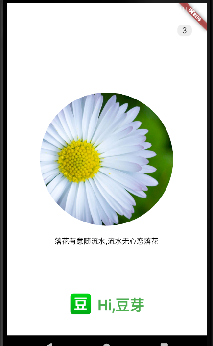
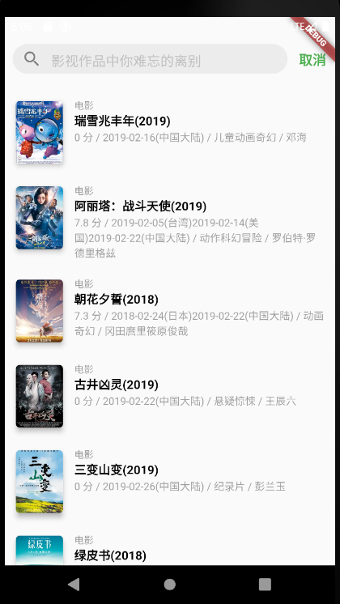

# 教你用Flutter一步步还原豆瓣APP

代码部分参考： https://github.com/kaina404/FlutterDouBan
<a href="./doc/0.准备工作.md">0.准备工作</a>

<a href="./doc/1.制作启动页面.md">1.制作启动页面</a>

<a href="./doc/2.制作整个APP外面容器.md">2.制作整个APP外面容器</a>

<a href="./doc/3.HomePage主页制作.md">3.HomePage主页制作</a>

<a href="./doc/4.视频显示.md">4.视频显示</a>

<a href="./doc/5.添加路由.md">5.添加路由</a>

<a href="./doc/6.远程API接口调用和搜索页面制作.md">6.远程API接口调用和搜索页面制作</a>

<a href="./doc/7.个人页面.md">7.个人页面</a>

未完待续。。

# douban

A new Flutter project.

## Getting Started

This project is a starting point for a Flutter application.

A few resources to get you started if this is your first Flutter project:

- [Lab: Write your first Flutter app](https://flutter.dev/docs/get-started/codelab)
- [Cookbook: Useful Flutter samples](https://flutter.dev/docs/cookbook)

For help getting started with Flutter, view our
[online documentation](https://flutter.dev/docs), which offers tutorials,
samples, guidance on mobile development, and a full API reference.
