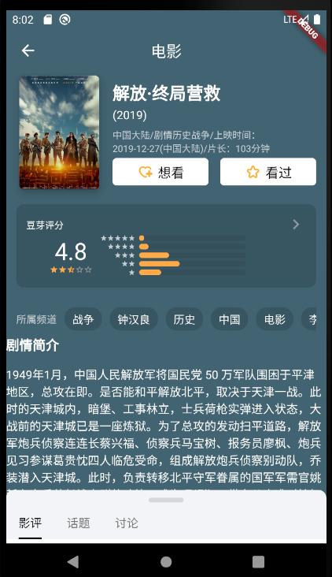
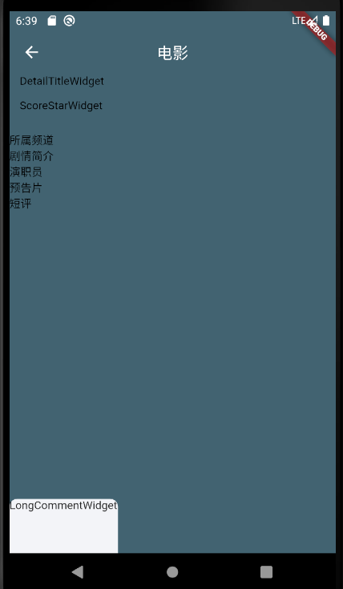
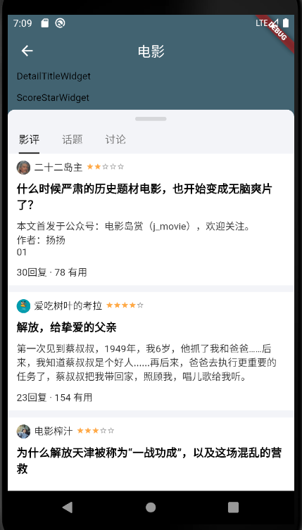
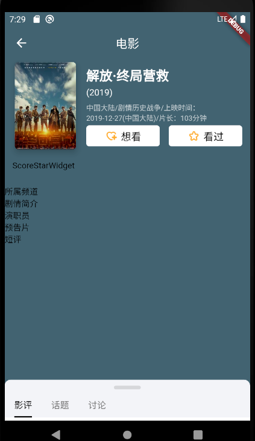
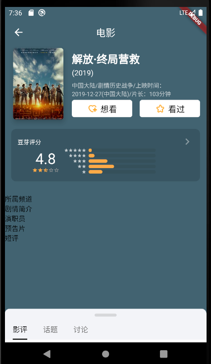
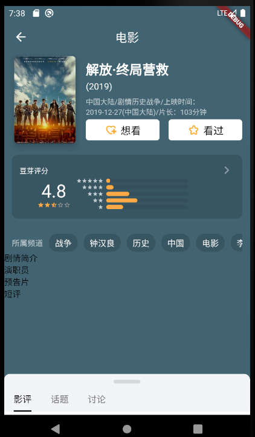
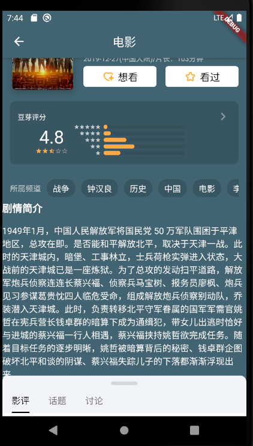
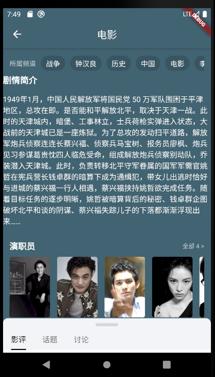
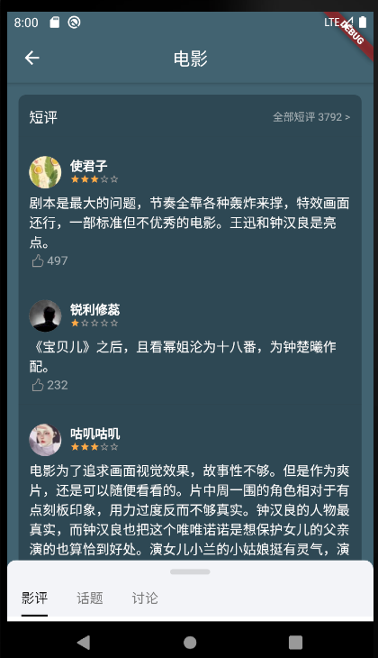

# 1. 电影细节页面



<!-- TOC -->

- [1. 电影细节页面](#1-电影细节页面)
    - [1.1. 基本的框架](#11-基本的框架)
        - [1.1.1. 新建CommentsEntiy 评论类](#111-新建commentsentiy-评论类)
        - [1.1.2. 新建 MovieLongCommentsEntity 长评论类](#112-新建-movielongcommentsentity-长评论类)
        - [1.1.3. 新建 MovieDetailBean 电影细节类](#113-新建-moviedetailbean-电影细节类)
        - [1.1.4. 新建上拉抽屉BottomDragWidget组件](#114-新建上拉抽屉bottomdragwidget组件)
        - [1.1.5. 新建长评论组件LongCommentWidget](#115-新建长评论组件longcommentwidget)
        - [1.1.6. 修改细节页面 DetailPage](#116-修改细节页面-detailpage)
    - [1.2. API接口获取数据](#12-api接口获取数据)
        - [1.2.1. 电影类 movie_detail_bean](#121-电影类-movie_detail_bean)
        - [1.2.2. 评论类 comments_entity](#122-评论类-comments_entity)
        - [1.2.3. 长评论类 MovieLongCommentsEntity](#123-长评论类-movielongcommentsentity)
        - [1.2.4. API获取远程数据](#124-api获取远程数据)
    - [1.3. 上拉抽屉](#13-上拉抽屉)
        - [1.3.1. 上拉抽屉](#131-上拉抽屉)
    - [1.4. body 主体内容](#14-body-主体内容)
        - [1.4.1. 基本框架](#141-基本框架)
        - [1.4.2. 长评论组件](#142-长评论组件)
        - [1.4.3. 细节标题 DetailTitleWidget](#143-细节标题-detailtitlewidget)
            - [1.4.3.1. 细节标题](#1431-细节标题)
            - [1.4.3.2. 想看、看过按钮](#1432-想看看过按钮)
        - [1.4.4. 豆芽评分组件](#144-豆芽评分组件)
        - [1.4.5. 所属频道](#145-所属频道)
        - [1.4.6. 剧情简介](#146-剧情简介)
        - [1.4.7. 演员表](#147-演员表)
        - [1.4.8. 预告片](#148-预告片)
            - [1.4.8.1. 点击显示大图](#1481-点击显示大图)
            - [1.4.8.2. trailers](#1482-trailers)
        - [1.4.9. 短评](#149-短评)

<!-- /TOC -->

## 1.1. 基本的框架



### 1.1.1. 新建CommentsEntiy 评论类

1、新建lib\model\comments_entity.dart

```
class CommentsEntiy {
  
}
```
### 1.1.2. 新建 MovieLongCommentsEntity 长评论类

2、新建lib\model\movie_long_comments.dart

```
class MovieLongCommentsEntity {
  
}
```

### 1.1.3. 新建 MovieDetailBean 电影细节类


3、新建lib\model\movie_detail_bean.dart

```
class MovieDetailBean {
  
}
```
### 1.1.4. 新建上拉抽屉BottomDragWidget组件

4、新建lib\widgets\bottom_drag_widget.dart

```
import 'package:flutter/material.dart';
///上拉抽屉
class BottomDragWidget extends StatelessWidget {
  final Widget body;
  final DragContainer dragContainer;

  BottomDragWidget({Key key, @required this.body, @required this.dragContainer})
    :assert(body!=null),
    assert(dragContainer != null),
    super(key:key);
  
  @override
  Widget build(BuildContext context) {
    
    return Container(
      child: Text('上拉抽屉'),
    );
  }
  
}
class DragController {
  
}
DragController _controller;
class DragContainer extends StatefulWidget {
  final Widget drawer;
  final double defaultShowHeight;
  final double height;
  DragContainer(
      {Key key,
      @required this.drawer,
      @required this.defaultShowHeight,
      @required this.height})
      : assert(drawer != null),
        assert(defaultShowHeight != null),
        assert(height != null),
        super(key: key){
    _controller = DragController();
  }
  @override
  State<StatefulWidget> createState() {
    return _DragContainerState();
  }
}
class _DragContainerState extends State<DragContainer> with TickerProviderStateMixin {
  @override
  Widget build(BuildContext context) {
   
    return Container(
      child: Text('上拉容器'),
    );
  }
  
}
class OverscrollNotificationWidget extends StatefulWidget {
  final Widget child;
  OverscrollNotificationWidget({
    Key key,@required this.child
  }):assert(child !=null),super(key:key);
  @override
  State<StatefulWidget> createState() {
    
    return _OverscrollNotificationWidgetState();
  }
  
}
class _OverscrollNotificationWidgetState extends State<OverscrollNotificationWidget> 
  with TickerProviderStateMixin{
  @override
  Widget build(BuildContext context) {
    
    return Container(
      child: Text('OverscrollNotificationWidget'),
    );
  }
  
}

```

### 1.1.5. 新建长评论组件LongCommentWidget

5、新建lib\views\detail\long_comment_widget.dart

```
// 电影长评论
import 'package:douban/model/movie_long_comments.dart';
import 'package:flutter/material.dart';

class LongCommentWidget extends StatelessWidget{
  final MovieLongCommentsEntity movieLongCommentsEntity;
  LongCommentWidget({Key key, @required this.movieLongCommentsEntity}):assert(movieLongCommentsEntity!=null),super(key:key);
  @override
  Widget build(BuildContext context) {
    
    return Container(child: Text('LongCommentWidget'),);
  }
  
}
```

### 1.1.6. 修改细节页面 DetailPage

6、修改 lib\views\detail\detail_page.dart

```
import 'package:douban/http/API.dart';
import 'package:douban/http/http_request.dart';
import 'package:douban/model/comments_entity.dart';
import 'package:douban/model/movie_detail_bean.dart';
import 'package:douban/model/movie_long_comments.dart';
import 'package:douban/widgets/bottom_drag_widget.dart';
import 'package:flutter/cupertino.dart';
import 'package:flutter/material.dart';

import 'long_comment_widget.dart';

///影片、电视详情页面
class DetailPage extends StatefulWidget {
  final subjectId;
  DetailPage({this.subjectId, Key key}):super(key:key);
  @override
  State<StatefulWidget> createState(){
    return _DetailPageState();
  }
}
class _DetailPageState extends State<DetailPage> {
  Color pickColor = Color(0xffffffff); //默认主题色
  CommentsEntity commentsEntity;
  MovieLongCommentsEntity movieLongCommentReviews;
  bool loading = true;
  MovieDetailBean movieDetailBean;
  var _request = HttpRequest(API.BASE_URL);
  double get screenH => MediaQuery.of(context).size.height;

  @override
  void initState(){
    super.initState();
    requestAPI();
  }
  @override
  Widget build(BuildContext context) {
    if (movieDetailBean == null ){
      // 加载页面
      return Scaffold(
        body: Center(
          child: CupertinoActivityIndicator(),
        ),
      );
    }
    return Scaffold(
        backgroundColor: pickColor,
        body: Container(
          child: SafeArea(
            child: BottomDragWidget(
              body: _getBody(),
              dragContainer: DragContainer(
                drawer: Container(
                  child: OverscrollNotificationWidget(
                    child: LongCommentWidget(
                      movieLongCommentsEntity: movieLongCommentReviews
                    ),
                  ),
                  decoration: BoxDecoration(
                    color: const Color.fromARGB(255, 243, 244, 248),
                    borderRadius: BorderRadius.only(
                      topLeft: Radius.circular(10.0),
                      topRight: Radius.circular(10.0),
                    ),
                  ),
                ),
                defaultShowHeight:screenH * 0.1,
                height: screenH * 0.8
              ),
            ),
          ),
        ),
      );
  }
  Widget _getBody(){
    return Container(
      child: Text('detailpage body'),
    );
  }
  void requestAPI() async{
    
  }
}
```

## 1.2. API接口获取数据

### 1.2.1. 电影类 movie_detail_bean

1、修改 lib\model\movie_detail_bean.dart

```
import 'dart:convert' show json;

///影视条目详情
class MovieDetailBean {

  bool collection;
  String current_season;
  var do_count;
  var episodes_count;
  var seasons_count;
  var collect_count;
  var comments_count;
  var photos_count;
  var ratings_count;
  var reviews_count;
  var wish_count;
  bool has_schedule;
  bool has_ticket;
  bool has_video;
  String alt;
  String douban_site;
  String id;
  String mainland_pubdate;
  String mobile_url;
  String original_title;
  String pubdate;
  String schedule_url;
  String share_url;
  String subtype;
  String summary;
  String title;
  String website;
  String year;
  List<String> aka;
  List<String> blooper_urls;
  List<Blooper> bloopers;
  List<Cast> casts;
  List<dynamic> clip_urls;
  List<dynamic> clips;
  List<String> countries;
  List<Director> directors;
  List<String> durations;
  List<String> genres;
  List<String> languages;
  List<Photo> photos;
  List<PopularComment> popular_comments;
  List<PopularReview> popular_reviews;
  List<String> pubdates;
  List<String> tags;
  List<String> trailer_urls;
  List<Blooper> trailers;
  List<dynamic> videos;
  List<Writer> writers;
  _Image images;
  Rating rating;

  MovieDetailBean.fromParams({this.collection, this.current_season, this.do_count, this.episodes_count, this.seasons_count, this.collect_count, this.comments_count, this.photos_count, this.ratings_count, this.reviews_count, this.wish_count, this.has_schedule, this.has_ticket, this.has_video, this.alt, this.douban_site, this.id, this.mainland_pubdate, this.mobile_url, this.original_title, this.pubdate, this.schedule_url, this.share_url, this.subtype, this.summary, this.title, this.website, this.year, this.aka, this.blooper_urls, this.bloopers, this.casts, this.clip_urls, this.clips, this.countries, this.directors, this.durations, this.genres, this.languages, this.photos, this.popular_comments, this.popular_reviews, this.pubdates, this.tags, this.trailer_urls, this.trailers, this.videos, this.writers, this.images, this.rating});

  factory MovieDetailBean(jsonStr) => jsonStr == null ? null : jsonStr is String ? new MovieDetailBean.fromJson(json.decode(jsonStr)) : new MovieDetailBean.fromJson(jsonStr);

  MovieDetailBean.fromJson(jsonRes) {
    collection = jsonRes['collection'];
    current_season = jsonRes['current_season'];
    do_count = jsonRes['do_count'];
    episodes_count = jsonRes['episodes_count'];
    seasons_count = jsonRes['seasons_count'];
    collect_count = jsonRes['collect_count'];
    comments_count = jsonRes['comments_count'];
    photos_count = jsonRes['photos_count'];
    ratings_count = jsonRes['ratings_count'];
    reviews_count = jsonRes['reviews_count'];
    wish_count = jsonRes['wish_count'];
    has_schedule = jsonRes['has_schedule'];
    has_ticket = jsonRes['has_ticket'];
    has_video = jsonRes['has_video'];
    alt = jsonRes['alt'];
    douban_site = jsonRes['douban_site'];
    id = jsonRes['id'];
    mainland_pubdate = jsonRes['mainland_pubdate'];
    mobile_url = jsonRes['mobile_url'];
    original_title = jsonRes['original_title'];
    pubdate = jsonRes['pubdate'];
    schedule_url = jsonRes['schedule_url'];
    share_url = jsonRes['share_url'];
    subtype = jsonRes['subtype'];
    summary = jsonRes['summary'];
    title = jsonRes['title'];
    website = jsonRes['website'];
    year = jsonRes['year'];
    aka = jsonRes['aka'] == null ? null : [];

    for (var akaItem in aka == null ? [] : jsonRes['aka']){
      aka.add(akaItem);
    }

    blooper_urls = jsonRes['blooper_urls'] == null ? null : [];

    for (var blooper_urlsItem in blooper_urls == null ? [] : jsonRes['blooper_urls']){
      blooper_urls.add(blooper_urlsItem);
    }

    bloopers = jsonRes['bloopers'] == null ? null : [];

    for (var bloopersItem in bloopers == null ? [] : jsonRes['bloopers']){
      bloopers.add(bloopersItem == null ? null : new Blooper.fromJson(bloopersItem));
    }

    casts = jsonRes['casts'] == null ? null : [];

    for (var castsItem in casts == null ? [] : jsonRes['casts']){
      casts.add(castsItem == null ? null : new Cast.fromJson(castsItem));
    }

    clip_urls = jsonRes['clip_urls'] == null ? null : [];

    for (var clip_urlsItem in clip_urls == null ? [] : jsonRes['clip_urls']){
      clip_urls.add(clip_urlsItem);
    }

    clips = jsonRes['clips'] == null ? null : [];

    for (var clipsItem in clips == null ? [] : jsonRes['clips']){
      clips.add(clipsItem);
    }

    countries = jsonRes['countries'] == null ? null : [];

    for (var countriesItem in countries == null ? [] : jsonRes['countries']){
      countries.add(countriesItem);
    }

    directors = jsonRes['directors'] == null ? null : [];

    for (var directorsItem in directors == null ? [] : jsonRes['directors']){
      directors.add(directorsItem == null ? null : new Director.fromJson(directorsItem));
    }

    durations = jsonRes['durations'] == null ? null : [];

    for (var durationsItem in durations == null ? [] : jsonRes['durations']){
      durations.add(durationsItem);
    }

    genres = jsonRes['genres'] == null ? null : [];

    for (var genresItem in genres == null ? [] : jsonRes['genres']){
      genres.add(genresItem);
    }

    languages = jsonRes['languages'] == null ? null : [];

    for (var languagesItem in languages == null ? [] : jsonRes['languages']){
      languages.add(languagesItem);
    }

    photos = jsonRes['photos'] == null ? null : [];

    for (var photosItem in photos == null ? [] : jsonRes['photos']){
      photos.add(photosItem == null ? null : new Photo.fromJson(photosItem));
    }

    popular_comments = jsonRes['popular_comments'] == null ? null : [];

    for (var popular_commentsItem in popular_comments == null ? [] : jsonRes['popular_comments']){
      popular_comments.add(popular_commentsItem == null ? null : new PopularComment.fromJson(popular_commentsItem));
    }

    popular_reviews = jsonRes['popular_reviews'] == null ? null : [];

    for (var popular_reviewsItem in popular_reviews == null ? [] : jsonRes['popular_reviews']){
      popular_reviews.add(popular_reviewsItem == null ? null : new PopularReview.fromJson(popular_reviewsItem));
    }

    pubdates = jsonRes['pubdates'] == null ? null : [];

    for (var pubdatesItem in pubdates == null ? [] : jsonRes['pubdates']){
      pubdates.add(pubdatesItem);
    }

    tags = jsonRes['tags'] == null ? null : [];

    for (var tagsItem in tags == null ? [] : jsonRes['tags']){
      tags.add(tagsItem);
    }

    trailer_urls = jsonRes['trailer_urls'] == null ? null : [];

    for (var trailer_urlsItem in trailer_urls == null ? [] : jsonRes['trailer_urls']){
      trailer_urls.add(trailer_urlsItem);
    }

    trailers = jsonRes['trailers'] == null ? null : [];

    for (var trailersItem in trailers == null ? [] : jsonRes['trailers']){
      trailers.add(trailersItem == null ? null : new Blooper.fromJson(trailersItem));
    }

    videos = jsonRes['videos'] == null ? null : [];

    for (var videosItem in videos == null ? [] : jsonRes['videos']){
      videos.add(videosItem);
    }

    writers = jsonRes['writers'] == null ? null : [];

    for (var writersItem in writers == null ? [] : jsonRes['writers']){
      writers.add(writersItem == null ? null : new Writer.fromJson(writersItem));
    }

    images = jsonRes['images'] == null ? null : new _Image.fromJson(jsonRes['images']);
    rating = jsonRes['rating'] == null ? null : new Rating.fromJson(jsonRes['rating']);
  }

  @override
  String toString() {
    return '{"collection": $collection,"current_season": ${current_season != null?'${json.encode(current_season)}':'null'},"do_count": $do_count,"episodes_count": $episodes_count,"seasons_count": $seasons_count,"collect_count": $collect_count,"comments_count": $comments_count,"photos_count": $photos_count,"ratings_count": $ratings_count,"reviews_count": $reviews_count,"wish_count": $wish_count,"has_schedule": $has_schedule,"has_ticket": $has_ticket,"has_video": $has_video,"alt": ${alt != null?'${json.encode(alt)}':'null'},"douban_site": ${douban_site != null?'${json.encode(douban_site)}':'null'},"id": ${id != null?'${json.encode(id)}':'null'},"mainland_pubdate": ${mainland_pubdate != null?'${json.encode(mainland_pubdate)}':'null'},"mobile_url": ${mobile_url != null?'${json.encode(mobile_url)}':'null'},"original_title": ${original_title != null?'${json.encode(original_title)}':'null'},"pubdate": ${pubdate != null?'${json.encode(pubdate)}':'null'},"schedule_url": ${schedule_url != null?'${json.encode(schedule_url)}':'null'},"share_url": ${share_url != null?'${json.encode(share_url)}':'null'},"subtype": ${subtype != null?'${json.encode(subtype)}':'null'},"summary": ${summary != null?'${json.encode(summary)}':'null'},"title": ${title != null?'${json.encode(title)}':'null'},"website": ${website != null?'${json.encode(website)}':'null'},"year": ${year != null?'${json.encode(year)}':'null'},"aka": $aka,"blooper_urls": $blooper_urls,"bloopers": $bloopers,"casts": $casts,"clip_urls": $clip_urls,"clips": $clips,"countries": $countries,"directors": $directors,"durations": $durations,"genres": $genres,"languages": $languages,"photos": $photos,"popular_comments": $popular_comments,"popular_reviews": $popular_reviews,"pubdates": $pubdates,"tags": $tags,"trailer_urls": $trailer_urls,"trailers": $trailers,"videos": $videos,"writers": $writers,"images": $images,"rating": $rating}';
  }
}

class Rating {

  var max;
  var min;
  var average;
  String stars;
  RatingDetails details;

  Rating.fromParams({this.max, this.min, this.average, this.stars, this.details});

  Rating.fromJson(jsonRes) {
    max = jsonRes['max'];
    min = jsonRes['min'];
    average = jsonRes['average'];
    stars = jsonRes['stars'];
    details = jsonRes['details'] == null ? null : new RatingDetails.fromJson(jsonRes['details']);
  }

  @override
  String toString() {
    return '{"max": $max,"min": $min,"average": $average,"stars": ${stars != null?'${json.encode(stars)}':'null'},"details": $details}';
  }
}

class RatingDetails {

  var d1;
  var d2;
  var d3;
  var d4;
  var d5;

  RatingDetails.fromParams({this.d1, this.d2, this.d3, this.d4, this.d5});

  RatingDetails.fromJson(jsonRes) {
    d1 = jsonRes['1'];
    d2 = jsonRes['2'];
    d3 = jsonRes['3'];
    d4 = jsonRes['4'];
    d5 = jsonRes['5'];
  }

  @override
  String toString() {
    return '{"1": $d1,"2": $d2,"3": $d3,"4": $d4,"5": $d5}';
  }
}

class _Image {

  String large;
  String medium;
  String small;

  _Image.fromParams({this.large, this.medium, this.small});

  _Image.fromJson(jsonRes) {
    large = jsonRes['large'];
    medium = jsonRes['medium'];
    small = jsonRes['small'];
  }

  @override
  String toString() {
    return '{"large": ${large != null?'${json.encode(large)}':'null'},"medium": ${medium != null?'${json.encode(medium)}':'null'},"small": ${small != null?'${json.encode(small)}':'null'}}';
  }
}

class Writer {

  String alt;
  String id;
  String name;
  String name_en;
  WriterAvatars avatars;

  Writer.fromParams({this.alt, this.id, this.name, this.name_en, this.avatars});

  Writer.fromJson(jsonRes) {
    alt = jsonRes['alt'];
    id = jsonRes['id'];
    name = jsonRes['name'];
    name_en = jsonRes['name_en'];
    avatars = jsonRes['avatars'] == null ? null : new WriterAvatars.fromJson(jsonRes['avatars']);
  }

  @override
  String toString() {
    return '{"alt": ${alt != null?'${json.encode(alt)}':'null'},"id": ${id != null?'${json.encode(id)}':'null'},"name": ${name != null?'${json.encode(name)}':'null'},"name_en": ${name_en != null?'${json.encode(name_en)}':'null'},"avatars": $avatars}';
  }
}

class WriterAvatars {

  String large;
  String medium;
  String small;

  WriterAvatars.fromParams({this.large, this.medium, this.small});

  WriterAvatars.fromJson(jsonRes) {
    large = jsonRes['large'];
    medium = jsonRes['medium'];
    small = jsonRes['small'];
  }

  @override
  String toString() {
    return '{"large": ${large != null?'${json.encode(large)}':'null'},"medium": ${medium != null?'${json.encode(medium)}':'null'},"small": ${small != null?'${json.encode(small)}':'null'}}';
  }
}

//class Trailer {
//
//  String alt;
//  String id;
//  String medium;
//  String resource_url;
//  String small;
//  String subject_id;
//  String title;
//
//  Trailer.fromParams({this.alt, this.id, this.medium, this.resource_url, this.small, this.subject_id, this.title});
//
//  Trailer.fromJson(jsonRes) {
//    alt = jsonRes['alt'];
//    id = jsonRes['id'];
//    medium = jsonRes['medium'];
//    resource_url = jsonRes['resource_url'];
//    small = jsonRes['small'];
//    subject_id = jsonRes['subject_id'];
//    title = jsonRes['title'];
//  }
//
//  @override
//  String toString() {
//    return '{"alt": ${alt != null?'${json.encode(alt)}':'null'},"id": ${id != null?'${json.encode(id)}':'null'},"medium": ${medium != null?'${json.encode(medium)}':'null'},"resource_url": ${resource_url != null?'${json.encode(resource_url)}':'null'},"small": ${small != null?'${json.encode(small)}':'null'},"subject_id": ${subject_id != null?'${json.encode(subject_id)}':'null'},"title": ${title != null?'${json.encode(title)}':'null'}}';
//  }
//}

class PopularReview {

  String alt;
  String id;
  String subject_id;
  String summary;
  String title;
  PopularReviewAuthor author;
  PopularReviewRating rating;

  PopularReview.fromParams({this.alt, this.id, this.subject_id, this.summary, this.title, this.author, this.rating});

  PopularReview.fromJson(jsonRes) {
    alt = jsonRes['alt'];
    id = jsonRes['id'];
    subject_id = jsonRes['subject_id'];
    summary = jsonRes['summary'];
    title = jsonRes['title'];
    author = jsonRes['author'] == null ? null : new PopularReviewAuthor.fromJson(jsonRes['author']);
    rating = jsonRes['rating'] == null ? null : new PopularReviewRating.fromJson(jsonRes['rating']);
  }

  @override
  String toString() {
    return '{"alt": ${alt != null?'${json.encode(alt)}':'null'},"id": ${id != null?'${json.encode(id)}':'null'},"subject_id": ${subject_id != null?'${json.encode(subject_id)}':'null'},"summary": ${summary != null?'${json.encode(summary)}':'null'},"title": ${title != null?'${json.encode(title)}':'null'},"author": $author,"rating": $rating}';
  }
}

class PopularReviewRating {

  var max;
  var min;
  var value;

  PopularReviewRating.fromParams({this.max, this.min, this.value});

  PopularReviewRating.fromJson(jsonRes) {
    max = jsonRes['max'];
    min = jsonRes['min'];
    value = jsonRes['value'];
  }

  @override
  String toString() {
    return '{"max": $max,"min": $min,"value": $value}';
  }
}

class PopularReviewAuthor {

  String alt;
  String avatar;
  String id;
  String name;
  String signature;
  String uid;

  PopularReviewAuthor.fromParams({this.alt, this.avatar, this.id, this.name, this.signature, this.uid});

  PopularReviewAuthor.fromJson(jsonRes) {
    alt = jsonRes['alt'];
    avatar = jsonRes['avatar'];
    id = jsonRes['id'];
    name = jsonRes['name'];
    signature = jsonRes['signature'];
    uid = jsonRes['uid'];
  }

  @override
  String toString() {
    return '{"alt": ${alt != null?'${json.encode(alt)}':'null'},"avatar": ${avatar != null?'${json.encode(avatar)}':'null'},"id": ${id != null?'${json.encode(id)}':'null'},"name": ${name != null?'${json.encode(name)}':'null'},"signature": ${signature != null?'${json.encode(signature)}':'null'},"uid": ${uid != null?'${json.encode(uid)}':'null'}}';
  }
}

class PopularComment {

  var useful_count;
  String content;
  String created_at;
  String id;
  String subject_id;
  PopularCommentAuthor author;
  PopularCommentRating rating;

  PopularComment.fromParams({this.useful_count, this.content, this.created_at, this.id, this.subject_id, this.author, this.rating});

  PopularComment.fromJson(jsonRes) {
    useful_count = jsonRes['useful_count'];
    content = jsonRes['content'];
    created_at = jsonRes['created_at'];
    id = jsonRes['id'];
    subject_id = jsonRes['subject_id'];
    author = jsonRes['author'] == null ? null : new PopularCommentAuthor.fromJson(jsonRes['author']);
    rating = jsonRes['rating'] == null ? null : new PopularCommentRating.fromJson(jsonRes['rating']);
  }

  @override
  String toString() {
    return '{"useful_count": $useful_count,"content": ${content != null?'${json.encode(content)}':'null'},"created_at": ${created_at != null?'${json.encode(created_at)}':'null'},"id": ${id != null?'${json.encode(id)}':'null'},"subject_id": ${subject_id != null?'${json.encode(subject_id)}':'null'},"author": $author,"rating": $rating}';
  }
}

class PopularCommentRating {

  var max;
  var min;
  var value;

  PopularCommentRating.fromParams({this.max, this.min, this.value});

  PopularCommentRating.fromJson(jsonRes) {
    max = jsonRes['max'];
    min = jsonRes['min'];
    value = jsonRes['value'];
  }

  @override
  String toString() {
    return '{"max": $max,"min": $min,"value": $value}';
  }
}

class PopularCommentAuthor {

  String alt;
  String avatar;
  String id;
  String name;
  String signature;
  String uid;

  PopularCommentAuthor.fromParams({this.alt, this.avatar, this.id, this.name, this.signature, this.uid});

  PopularCommentAuthor.fromJson(jsonRes) {
    alt = jsonRes['alt'];
    avatar = jsonRes['avatar'];
    id = jsonRes['id'];
    name = jsonRes['name'];
    signature = jsonRes['signature'];
    uid = jsonRes['uid'];
  }

  @override
  String toString() {
    return '{"alt": ${alt != null?'${json.encode(alt)}':'null'},"avatar": ${avatar != null?'${json.encode(avatar)}':'null'},"id": ${id != null?'${json.encode(id)}':'null'},"name": ${name != null?'${json.encode(name)}':'null'},"signature": ${signature != null?'${json.encode(signature)}':'null'},"uid": ${uid != null?'${json.encode(uid)}':'null'}}';
  }
}

class Photo {

  String alt;
  String cover;
  String icon;
  String id;
  String image;
  String thumb;

  Photo.fromParams({this.alt, this.cover, this.icon, this.id, this.image, this.thumb});

  Photo.fromJson(jsonRes) {
    alt = jsonRes['alt'];
    cover = jsonRes['cover'];
    icon = jsonRes['icon'];
    id = jsonRes['id'];
    image = jsonRes['image'];
    thumb = jsonRes['thumb'];
  }

  @override
  String toString() {
    return '{"alt": ${alt != null?'${json.encode(alt)}':'null'},"cover": ${cover != null?'${json.encode(cover)}':'null'},"icon": ${icon != null?'${json.encode(icon)}':'null'},"id": ${id != null?'${json.encode(id)}':'null'},"image": ${image != null?'${json.encode(image)}':'null'},"thumb": ${thumb != null?'${json.encode(thumb)}':'null'}}';
  }
}

class Director {

  String alt;
  String id;
  String name;
  String name_en;
  DirectorAvatars avatars;

  Director.fromParams({this.alt, this.id, this.name, this.name_en, this.avatars});

  Director.fromJson(jsonRes) {
    alt = jsonRes['alt'];
    id = jsonRes['id'];
    name = jsonRes['name'];
    name_en = jsonRes['name_en'];
    avatars = jsonRes['avatars'] == null ? null : new DirectorAvatars.fromJson(jsonRes['avatars']);
  }

  @override
  String toString() {
    return '{"alt": ${alt != null?'${json.encode(alt)}':'null'},"id": ${id != null?'${json.encode(id)}':'null'},"name": ${name != null?'${json.encode(name)}':'null'},"name_en": ${name_en != null?'${json.encode(name_en)}':'null'},"avatars": $avatars}';
  }
}

class DirectorAvatars {

  String large;
  String medium;
  String small;

  DirectorAvatars.fromParams({this.large, this.medium, this.small});

  DirectorAvatars.fromJson(jsonRes) {
    large = jsonRes['large'];
    medium = jsonRes['medium'];
    small = jsonRes['small'];
  }

  @override
  String toString() {
    return '{"large": ${large != null?'${json.encode(large)}':'null'},"medium": ${medium != null?'${json.encode(medium)}':'null'},"small": ${small != null?'${json.encode(small)}':'null'}}';
  }
}

class Cast {

  String alt;
  String id;
  String name;
  String name_en;
  CastAvatars avatars;

  Cast.fromParams({this.alt, this.id, this.name, this.name_en, this.avatars});

  Cast.fromJson(jsonRes) {
    alt = jsonRes['alt'];
    id = jsonRes['id'];
    name = jsonRes['name'];
    name_en = jsonRes['name_en'];
    avatars = jsonRes['avatars'] == null ? null : new CastAvatars.fromJson(jsonRes['avatars']);
  }

  @override
  String toString() {
    return '{"alt": ${alt != null?'${json.encode(alt)}':'null'},"id": ${id != null?'${json.encode(id)}':'null'},"name": ${name != null?'${json.encode(name)}':'null'},"name_en": ${name_en != null?'${json.encode(name_en)}':'null'},"avatars": $avatars}';
  }
}

class CastAvatars {

  String large;
  String medium;
  String small;

  CastAvatars.fromParams({this.large, this.medium, this.small});

  CastAvatars.fromJson(jsonRes) {
    large = jsonRes['large'];
    medium = jsonRes['medium'];
    small = jsonRes['small'];
  }

  @override
  String toString() {
    return '{"large": ${large != null?'${json.encode(large)}':'null'},"medium": ${medium != null?'${json.encode(medium)}':'null'},"small": ${small != null?'${json.encode(small)}':'null'}}';
  }
}

class Blooper {

  String alt;
  String id;
  String medium;
  String resource_url;
  String small;
  String subject_id;
  String title;

  Blooper.fromParams({this.alt, this.id, this.medium, this.resource_url, this.small, this.subject_id, this.title});

  Blooper.fromJson(jsonRes) {
    alt = jsonRes['alt'];
    id = jsonRes['id'];
    medium = jsonRes['medium'];
    resource_url = jsonRes['resource_url'];
    small = jsonRes['small'];
    subject_id = jsonRes['subject_id'];
    title = jsonRes['title'];
  }

  @override
  String toString() {
    return '{"alt": ${alt != null?'${json.encode(alt)}':'null'},"id": ${id != null?'${json.encode(id)}':'null'},"medium": ${medium != null?'${json.encode(medium)}':'null'},"resource_url": ${resource_url != null?'${json.encode(resource_url)}':'null'},"small": ${small != null?'${json.encode(small)}':'null'},"subject_id": ${subject_id != null?'${json.encode(subject_id)}':'null'},"title": ${title != null?'${json.encode(title)}':'null'}}';
  }
}

```

### 1.2.2. 评论类 comments_entity

2、修改 lib\model\comments_entity.dart

```
class CommentsEntity {
	int total;
	List<CommantsBeanCommants> comments;
	int nextStart;
	CommentsBeanSubject subject;
	int count;
	int start;
 

	CommentsEntity({this.total, this.comments, this.nextStart, this.subject, this.count, this.start});

	CommentsEntity.fromJson(Map<String, dynamic> json) {
		total = json['total'];
		if (json['comments'] != null) {
			comments = new List<CommantsBeanCommants>();
			json['comments'].forEach((v) { comments.add(new CommantsBeanCommants.fromJson(v)); });
		}
		nextStart = json['next_start'];
		subject = json['subject'] != null ? new CommentsBeanSubject.fromJson(json['subject']) : null;
		count = json['count'];
		start = json['start'];
	}

	Map<String, dynamic> toJson() {
		final Map<String, dynamic> data = new Map<String, dynamic>();
		data['total'] = this.total;
		if (this.comments != null) {
      data['comments'] = this.comments.map((v) => v.toJson()).toList();
    }
		data['next_start'] = this.nextStart;
		if (this.subject != null) {
      data['subject'] = this.subject.toJson();
    }
		data['count'] = this.count;
		data['start'] = this.start;
		return data;
	}
}

class CommantsBeanCommants {
	String subjectId;
	CommentsBeanCommentsAuthor author;
	CommentsBeanCommentsRating rating;
	String createdAt;
	String id;
	int usefulCount;
	String content;

	CommantsBeanCommants({this.subjectId, this.author, this.rating, this.createdAt, this.id, this.usefulCount, this.content});

	CommantsBeanCommants.fromJson(Map<String, dynamic> json) {
		subjectId = json['subject_id'];
		author = json['author'] != null ? new CommentsBeanCommentsAuthor.fromJson(json['author']) : null;
		rating = json['rating'] != null ? new CommentsBeanCommentsRating.fromJson(json['rating']) : null;
		createdAt = json['created_at'];
		id = json['id'];
		usefulCount = json['useful_count'];
		content = json['content'];
	}

	Map<String, dynamic> toJson() {
		final Map<String, dynamic> data = new Map<String, dynamic>();
		data['subject_id'] = this.subjectId;
		if (this.author != null) {
      data['author'] = this.author.toJson();
    }
		if (this.rating != null) {
      data['rating'] = this.rating.toJson();
    }
		data['created_at'] = this.createdAt;
		data['id'] = this.id;
		data['useful_count'] = this.usefulCount;
		data['content'] = this.content;
		return data;
	}
}

class CommentsBeanCommentsAuthor {
	String uid;
	String signature;
	String alt;
	String name;
	String avatar;
	String id;

	CommentsBeanCommentsAuthor({this.uid, this.signature, this.alt, this.name, this.avatar, this.id});

	CommentsBeanCommentsAuthor.fromJson(Map<String, dynamic> json) {
		uid = json['uid'];
		signature = json['signature'];
		alt = json['alt'];
		name = json['name'];
		avatar = json['avatar'];
		id = json['id'];
	}

	Map<String, dynamic> toJson() {
		final Map<String, dynamic> data = new Map<String, dynamic>();
		data['uid'] = this.uid;
		data['signature'] = this.signature;
		data['alt'] = this.alt;
		data['name'] = this.name;
		data['avatar'] = this.avatar;
		data['id'] = this.id;
		return data;
	}
}

class CommentsBeanCommentsRating {
	var min;
	var max;
	var value;

	CommentsBeanCommentsRating({this.min, this.max, this.value});

	CommentsBeanCommentsRating.fromJson(Map<String, dynamic> json) {
		min = json['min'];
		max = json['max'];
		value = json['value'];
	}

	Map<String, dynamic> toJson() {
		final Map<String, dynamic> data = new Map<String, dynamic>();
		data['min'] = this.min;
		data['max'] = this.max;
		data['value'] = this.value;
		return data;
	}
}

class CommentsBeanSubject {
	CommentsBeanSubjectImages images;
	String originalTitle;
	String year;
	List<CommantsBeanSubjectDirectors> directors;
	CommentsBeanSubjectRating rating;
	String alt;
	String title;
	int collectCount;
	bool hasVideo;
	List<String> pubdates;
	List<CommantsBeanSubjectCasts> casts;
	String subtype;
	List<String> genres;
	List<String> durations;
	String mainlandPubdate;
	String id;

	CommentsBeanSubject({this.images, this.originalTitle, this.year, this.directors, this.rating, this.alt, this.title, this.collectCount, this.hasVideo, this.pubdates, this.casts, this.subtype, this.genres, this.durations, this.mainlandPubdate, this.id});

	CommentsBeanSubject.fromJson(Map<String, dynamic> json) {
		images = json['images'] != null ? new CommentsBeanSubjectImages.fromJson(json['images']) : null;
		originalTitle = json['original_title'];
		year = json['year'];
		if (json['directors'] != null) {
			directors = new List<CommantsBeanSubjectDirectors>();
			json['directors'].forEach((v) { directors.add(new CommantsBeanSubjectDirectors.fromJson(v)); });
		}
		rating = json['rating'] != null ? new CommentsBeanSubjectRating.fromJson(json['rating']) : null;
		alt = json['alt'];
		title = json['title'];
		collectCount = json['collect_count'];
		hasVideo = json['has_video'];
		pubdates = json['pubdates'].cast<String>();
		if (json['casts'] != null) {
			casts = new List<CommantsBeanSubjectCasts>();
			json['casts'].forEach((v) { casts.add(new CommantsBeanSubjectCasts.fromJson(v)); });
		}
		subtype = json['subtype'];
		genres = json['genres'].cast<String>();
		durations = json['durations'].cast<String>();
		mainlandPubdate = json['mainland_pubdate'];
		id = json['id'];
	}

	Map<String, dynamic> toJson() {
		final Map<String, dynamic> data = new Map<String, dynamic>();
		if (this.images != null) {
      data['images'] = this.images.toJson();
    }
		data['original_title'] = this.originalTitle;
		data['year'] = this.year;
		if (this.directors != null) {
      data['directors'] = this.directors.map((v) => v.toJson()).toList();
    }
		if (this.rating != null) {
      data['rating'] = this.rating.toJson();
    }
		data['alt'] = this.alt;
		data['title'] = this.title;
		data['collect_count'] = this.collectCount;
		data['has_video'] = this.hasVideo;
		data['pubdates'] = this.pubdates;
		if (this.casts != null) {
      data['casts'] = this.casts.map((v) => v.toJson()).toList();
    }
		data['subtype'] = this.subtype;
		data['genres'] = this.genres;
		data['durations'] = this.durations;
		data['mainland_pubdate'] = this.mainlandPubdate;
		data['id'] = this.id;
		return data;
	}
}

class CommentsBeanSubjectImages {
	String small;
	String large;
	String medium;

	CommentsBeanSubjectImages({this.small, this.large, this.medium});

	CommentsBeanSubjectImages.fromJson(Map<String, dynamic> json) {
		small = json['small'];
		large = json['large'];
		medium = json['medium'];
	}

	Map<String, dynamic> toJson() {
		final Map<String, dynamic> data = new Map<String, dynamic>();
		data['small'] = this.small;
		data['large'] = this.large;
		data['medium'] = this.medium;
		return data;
	}
}

class CommantsBeanSubjectDirectors {
	String name;
	String alt;
	String id;
	CommentsBeanSubjectDirectorsAvatars avatars;
	String nameEn;

	CommantsBeanSubjectDirectors({this.name, this.alt, this.id, this.avatars, this.nameEn});

	CommantsBeanSubjectDirectors.fromJson(Map<String, dynamic> json) {
		name = json['name'];
		alt = json['alt'];
		id = json['id'];
		avatars = json['avatars'] != null ? new CommentsBeanSubjectDirectorsAvatars.fromJson(json['avatars']) : null;
		nameEn = json['name_en'];
	}

	Map<String, dynamic> toJson() {
		final Map<String, dynamic> data = new Map<String, dynamic>();
		data['name'] = this.name;
		data['alt'] = this.alt;
		data['id'] = this.id;
		if (this.avatars != null) {
      data['avatars'] = this.avatars.toJson();
    }
		data['name_en'] = this.nameEn;
		return data;
	}
}

class CommentsBeanSubjectDirectorsAvatars {
	String small;
	String large;
	String medium;

	CommentsBeanSubjectDirectorsAvatars({this.small, this.large, this.medium});

	CommentsBeanSubjectDirectorsAvatars.fromJson(Map<String, dynamic> json) {
		small = json['small'];
		large = json['large'];
		medium = json['medium'];
	}

	Map<String, dynamic> toJson() {
		final Map<String, dynamic> data = new Map<String, dynamic>();
		data['small'] = this.small;
		data['large'] = this.large;
		data['medium'] = this.medium;
		return data;
	}
}

class CommentsBeanSubjectRating {
	var average;
	var min;
	var max;
	CommentsBeanSubjectRatingDetails details;
	String stars;

	CommentsBeanSubjectRating({this.average, this.min, this.max, this.details, this.stars});

	CommentsBeanSubjectRating.fromJson(Map<String, dynamic> json) {
		average = json['average'];
		min = json['min'];
		max = json['max'];
		details = json['details'] != null ? new CommentsBeanSubjectRatingDetails.fromJson(json['details']) : null;
		stars = json['stars'];
	}

	Map<String, dynamic> toJson() {
		final Map<String, dynamic> data = new Map<String, dynamic>();
		data['average'] = this.average;
		data['min'] = this.min;
		data['max'] = this.max;
		if (this.details != null) {
      data['details'] = this.details.toJson();
    }
		data['stars'] = this.stars;
		return data;
	}
}

class CommentsBeanSubjectRatingDetails {
	var d1;
	var d2;
	var d3;
	var d4;
	var d5;

	CommentsBeanSubjectRatingDetails({this.d1, this.d2, this.d3, this.d4, this.d5});

	CommentsBeanSubjectRatingDetails.fromJson(Map<String, dynamic> json) {
		d1 = json['1'];
		d2 = json['2'];
		d3 = json['3'];
		d4 = json['4'];
		d5 = json['5'];
	}

	Map<String, dynamic> toJson() {
		final Map<String, dynamic> data = new Map<String, dynamic>();
		data['1'] = this.d1;
		data['2'] = this.d2;
		data['3'] = this.d3;
		data['4'] = this.d4;
		data['5'] = this.d5;
		return data;
	}
}

class CommantsBeanSubjectCasts {
	String name;
	String alt;
	String id;
	CommentsBeanSubjectCastsAvatars avatars;
	String nameEn;

	CommantsBeanSubjectCasts({this.name, this.alt, this.id, this.avatars, this.nameEn});

	CommantsBeanSubjectCasts.fromJson(Map<String, dynamic> json) {
		name = json['name'];
		alt = json['alt'];
		id = json['id'];
		avatars = json['avatars'] != null ? new CommentsBeanSubjectCastsAvatars.fromJson(json['avatars']) : null;
		nameEn = json['name_en'];
	}

	Map<String, dynamic> toJson() {
		final Map<String, dynamic> data = new Map<String, dynamic>();
		data['name'] = this.name;
		data['alt'] = this.alt;
		data['id'] = this.id;
		if (this.avatars != null) {
      data['avatars'] = this.avatars.toJson();
    }
		data['name_en'] = this.nameEn;
		return data;
	}
}

class CommentsBeanSubjectCastsAvatars {
	String small;
	String large;
	String medium;

	CommentsBeanSubjectCastsAvatars({this.small, this.large, this.medium});

	CommentsBeanSubjectCastsAvatars.fromJson(Map<String, dynamic> json) {
		small = json['small'];
		large = json['large'];
		medium = json['medium'];
	}

	Map<String, dynamic> toJson() {
		final Map<String, dynamic> data = new Map<String, dynamic>();
		data['small'] = this.small;
		data['large'] = this.large;
		data['medium'] = this.medium;
		return data;
	}
}

```
### 1.2.3. 长评论类 MovieLongCommentsEntity

3、修改 lib\model\movie_long_comments.dart

```
class MovieLongCommentsEntity {
	int total;
	int nextStart;
	List<MovieLongCommentReviews> reviews;
	MovieLongCommentsSubject subject;
	int count;
	int start;

	MovieLongCommentsEntity({this.total, this.nextStart, this.reviews, this.subject, this.count, this.start});

	MovieLongCommentsEntity.fromJson(Map<String, dynamic> json) {
		total = json['total'];
		nextStart = json['next_start'];
		if (json['reviews'] != null) {
			reviews = new List<MovieLongCommentReviews>();
			json['reviews'].forEach((v) { reviews.add(new MovieLongCommentReviews.fromJson(v)); });
		}
		subject = json['subject'] != null ? new MovieLongCommentsSubject.fromJson(json['subject']) : null;
		count = json['count'];
		start = json['start'];
	}

	Map<String, dynamic> toJson() {
		final Map<String, dynamic> data = new Map<String, dynamic>();
		data['total'] = this.total;
		data['next_start'] = this.nextStart;
		if (this.reviews != null) {
      data['reviews'] = this.reviews.map((v) => v.toJson()).toList();
    }
		if (this.subject != null) {
      data['subject'] = this.subject.toJson();
    }
		data['count'] = this.count;
		data['start'] = this.start;
		return data;
	}
}

class MovieLongCommentReviews {
	String summary;
	String subjectId;
	MovieLongCommentsReviewsAuthor author;
	MovieLongCommentsReviewsRating rating;
	String alt;
	String createdAt;
	String title;
	int uselessCount;
	String content;
	String updatedAt;
	String shareUrl;
	int commentsCount;
	String id;
	int usefulCount;

	MovieLongCommentReviews({this.summary, this.subjectId, this.author, this.rating, this.alt, this.createdAt, this.title, this.uselessCount, this.content, this.updatedAt, this.shareUrl, this.commentsCount, this.id, this.usefulCount});

	MovieLongCommentReviews.fromJson(Map<String, dynamic> json) {
		summary = json['summary'];
		subjectId = json['subject_id'];
		author = json['author'] != null ? new MovieLongCommentsReviewsAuthor.fromJson(json['author']) : null;
		rating = json['rating'] != null ? new MovieLongCommentsReviewsRating.fromJson(json['rating']) : null;
		alt = json['alt'];
		createdAt = json['created_at'];
		title = json['title'];
		uselessCount = json['useless_count'];
		content = json['content'];
		updatedAt = json['updated_at'];
		shareUrl = json['share_url'];
		commentsCount = json['comments_count'];
		id = json['id'];
		usefulCount = json['useful_count'];
	}

	Map<String, dynamic> toJson() {
		final Map<String, dynamic> data = new Map<String, dynamic>();
		data['summary'] = this.summary;
		data['subject_id'] = this.subjectId;
		if (this.author != null) {
      data['author'] = this.author.toJson();
    }
		if (this.rating != null) {
      data['rating'] = this.rating.toJson();
    }
		data['alt'] = this.alt;
		data['created_at'] = this.createdAt;
		data['title'] = this.title;
		data['useless_count'] = this.uselessCount;
		data['content'] = this.content;
		data['updated_at'] = this.updatedAt;
		data['share_url'] = this.shareUrl;
		data['comments_count'] = this.commentsCount;
		data['id'] = this.id;
		data['useful_count'] = this.usefulCount;
		return data;
	}
}

class MovieLongCommentsReviewsAuthor {
	String uid;
	String signature;
	String alt;
	String name;
	String avatar;
	String id;

	MovieLongCommentsReviewsAuthor({this.uid, this.signature, this.alt, this.name, this.avatar, this.id});

	MovieLongCommentsReviewsAuthor.fromJson(Map<String, dynamic> json) {
		uid = json['uid'];
		signature = json['signature'];
		alt = json['alt'];
		name = json['name'];
		avatar = json['avatar'];
		id = json['id'];
	}

	Map<String, dynamic> toJson() {
		final Map<String, dynamic> data = new Map<String, dynamic>();
		data['uid'] = this.uid;
		data['signature'] = this.signature;
		data['alt'] = this.alt;
		data['name'] = this.name;
		data['avatar'] = this.avatar;
		data['id'] = this.id;
		return data;
	}
}

class MovieLongCommentsReviewsRating {
	var min;
	var max;
	var value;

	MovieLongCommentsReviewsRating({this.min, this.max, this.value});

	MovieLongCommentsReviewsRating.fromJson(Map<String, dynamic> json) {
		min = json['min'];
		max = json['max'];
		value = json['value'];
	}

	Map<String, dynamic> toJson() {
		final Map<String, dynamic> data = new Map<String, dynamic>();
		data['min'] = this.min;
		data['max'] = this.max;
		data['value'] = this.value;
		return data;
	}
}

class MovieLongCommentsSubject {
	MovieLongCommentsSubjectImages images;
	String originalTitle;
	String year;
	List<MovieLongCommantsSubjectDirectors> directors;
	MovieLongCommentsSubjectRating rating;
	String alt;
	String title;
	int collectCount;
	bool hasVideo;
	List<String> pubdates;
	List<MovieLongCommantsSubjectCasts> casts;
	String subtype;
	List<String> genres;
	List<String> durations;
	String mainlandPubdate;
	String id;

	MovieLongCommentsSubject({this.images, this.originalTitle, this.year, this.directors, this.rating, this.alt, this.title, this.collectCount, this.hasVideo, this.pubdates, this.casts, this.subtype, this.genres, this.durations, this.mainlandPubdate, this.id});

	MovieLongCommentsSubject.fromJson(Map<String, dynamic> json) {
		images = json['images'] != null ? new MovieLongCommentsSubjectImages.fromJson(json['images']) : null;
		originalTitle = json['original_title'];
		year = json['year'];
		if (json['directors'] != null) {
			directors = new List<MovieLongCommantsSubjectDirectors>();
			json['directors'].forEach((v) { directors.add(new MovieLongCommantsSubjectDirectors.fromJson(v)); });
		}
		rating = json['rating'] != null ? new MovieLongCommentsSubjectRating.fromJson(json['rating']) : null;
		alt = json['alt'];
		title = json['title'];
		collectCount = json['collect_count'];
		hasVideo = json['has_video'];
		pubdates = json['pubdates'].cast<String>();
		if (json['casts'] != null) {
			casts = new List<MovieLongCommantsSubjectCasts>();
			json['casts'].forEach((v) { casts.add(new MovieLongCommantsSubjectCasts.fromJson(v)); });
		}
		subtype = json['subtype'];
		genres = json['genres'].cast<String>();
		durations = json['durations'].cast<String>();
		mainlandPubdate = json['mainland_pubdate'];
		id = json['id'];
	}

	Map<String, dynamic> toJson() {
		final Map<String, dynamic> data = new Map<String, dynamic>();
		if (this.images != null) {
      data['images'] = this.images.toJson();
    }
		data['original_title'] = this.originalTitle;
		data['year'] = this.year;
		if (this.directors != null) {
      data['directors'] = this.directors.map((v) => v.toJson()).toList();
    }
		if (this.rating != null) {
      data['rating'] = this.rating.toJson();
    }
		data['alt'] = this.alt;
		data['title'] = this.title;
		data['collect_count'] = this.collectCount;
		data['has_video'] = this.hasVideo;
		data['pubdates'] = this.pubdates;
		if (this.casts != null) {
      data['casts'] = this.casts.map((v) => v.toJson()).toList();
    }
		data['subtype'] = this.subtype;
		data['genres'] = this.genres;
		data['durations'] = this.durations;
		data['mainland_pubdate'] = this.mainlandPubdate;
		data['id'] = this.id;
		return data;
	}
}

class MovieLongCommentsSubjectImages {
	String small;
	String large;
	String medium;

	MovieLongCommentsSubjectImages({this.small, this.large, this.medium});

	MovieLongCommentsSubjectImages.fromJson(Map<String, dynamic> json) {
		small = json['small'];
		large = json['large'];
		medium = json['medium'];
	}

	Map<String, dynamic> toJson() {
		final Map<String, dynamic> data = new Map<String, dynamic>();
		data['small'] = this.small;
		data['large'] = this.large;
		data['medium'] = this.medium;
		return data;
	}
}

class MovieLongCommantsSubjectDirectors {
	String name;
	String alt;
	String id;
	MovieLongCommentsSubjectDirectorsAvatars avatars;
	String nameEn;

	MovieLongCommantsSubjectDirectors({this.name, this.alt, this.id, this.avatars, this.nameEn});

	MovieLongCommantsSubjectDirectors.fromJson(Map<String, dynamic> json) {
		name = json['name'];
		alt = json['alt'];
		id = json['id'];
		avatars = json['avatars'] != null ? new MovieLongCommentsSubjectDirectorsAvatars.fromJson(json['avatars']) : null;
		nameEn = json['name_en'];
	}

	Map<String, dynamic> toJson() {
		final Map<String, dynamic> data = new Map<String, dynamic>();
		data['name'] = this.name;
		data['alt'] = this.alt;
		data['id'] = this.id;
		if (this.avatars != null) {
      data['avatars'] = this.avatars.toJson();
    }
		data['name_en'] = this.nameEn;
		return data;
	}
}

class MovieLongCommentsSubjectDirectorsAvatars {
	String small;
	String large;
	String medium;

	MovieLongCommentsSubjectDirectorsAvatars({this.small, this.large, this.medium});

	MovieLongCommentsSubjectDirectorsAvatars.fromJson(Map<String, dynamic> json) {
		small = json['small'];
		large = json['large'];
		medium = json['medium'];
	}

	Map<String, dynamic> toJson() {
		final Map<String, dynamic> data = new Map<String, dynamic>();
		data['small'] = this.small;
		data['large'] = this.large;
		data['medium'] = this.medium;
		return data;
	}
}

class MovieLongCommentsSubjectRating {
	double average;
	int min;
	int max;
	MovieLongCommentsSubjectRatingDetails details;
	String stars;

	MovieLongCommentsSubjectRating({this.average, this.min, this.max, this.details, this.stars});

	MovieLongCommentsSubjectRating.fromJson(Map<String, dynamic> json) {
		average = json['average'];
		min = json['min'];
		max = json['max'];
		details = json['details'] != null ? new MovieLongCommentsSubjectRatingDetails.fromJson(json['details']) : null;
		stars = json['stars'];
	}

	Map<String, dynamic> toJson() {
		final Map<String, dynamic> data = new Map<String, dynamic>();
		data['average'] = this.average;
		data['min'] = this.min;
		data['max'] = this.max;
		if (this.details != null) {
      data['details'] = this.details.toJson();
    }
		data['stars'] = this.stars;
		return data;
	}
}

class MovieLongCommentsSubjectRatingDetails {
	double d1;
	double d2;
	double d3;
	double d4;
	double d5;

	MovieLongCommentsSubjectRatingDetails({this.d1, this.d2, this.d3, this.d4, this.d5});

	MovieLongCommentsSubjectRatingDetails.fromJson(Map<String, dynamic> json) {
		d1 = json['1'];
		d2 = json['2'];
		d3 = json['3'];
		d4 = json['4'];
		d5 = json['5'];
	}

	Map<String, dynamic> toJson() {
		final Map<String, dynamic> data = new Map<String, dynamic>();
		data['1'] = this.d1;
		data['2'] = this.d2;
		data['3'] = this.d3;
		data['4'] = this.d4;
		data['5'] = this.d5;
		return data;
	}
}

class MovieLongCommantsSubjectCasts {
	String name;
	String alt;
	String id;
	MovieLongCommentsSubjectCastsAvatars avatars;
	String nameEn;

	MovieLongCommantsSubjectCasts({this.name, this.alt, this.id, this.avatars, this.nameEn});

	MovieLongCommantsSubjectCasts.fromJson(Map<String, dynamic> json) {
		name = json['name'];
		alt = json['alt'];
		id = json['id'];
		avatars = json['avatars'] != null ? new MovieLongCommentsSubjectCastsAvatars.fromJson(json['avatars']) : null;
		nameEn = json['name_en'];
	}

	Map<String, dynamic> toJson() {
		final Map<String, dynamic> data = new Map<String, dynamic>();
		data['name'] = this.name;
		data['alt'] = this.alt;
		data['id'] = this.id;
		if (this.avatars != null) {
      data['avatars'] = this.avatars.toJson();
    }
		data['name_en'] = this.nameEn;
		return data;
	}
}

class MovieLongCommentsSubjectCastsAvatars {
	String small;
	String large;
	String medium;

	MovieLongCommentsSubjectCastsAvatars({this.small, this.large, this.medium});

	MovieLongCommentsSubjectCastsAvatars.fromJson(Map<String, dynamic> json) {
		small = json['small'];
		large = json['large'];
		medium = json['medium'];
	}

	Map<String, dynamic> toJson() {
		final Map<String, dynamic> data = new Map<String, dynamic>();
		data['small'] = this.small;
		data['large'] = this.large;
		data['medium'] = this.medium;
		return data;
	}
}

```
### 1.2.4. API获取远程数据

4、修改requestAPI()方法

```
void requestAPI() async{
    Future((){
      return _request.get(
        '/v2/movie/subject/${widget.subjectId}?apikey=0b2bdeda43b5688921839c8ecb20399b'
      );
    }).then((result){
      movieDetailBean = MovieDetailBean.fromJson(result);
      // 获取电影图片背景主颜色
      return PaletteGenerator.fromImageProvider(
        NetworkImage(movieDetailBean.images.large)
      );
    }).then((paletteGenerator){
      if (paletteGenerator!=null && paletteGenerator.colors.isNotEmpty){
        pickColor = paletteGenerator.colors.toList()[0];
      }
      // 获取评论
      return _request.get(
        '/v2/movie/subject/${widget.subjectId}/comments?apikey=0b2bdeda43b5688921839c8ecb20399b');
    }).then((result2){
      commentsEntity = CommentsEntity.fromJson(result2);
    }).then((_){
      // 获取影评
      return _request.get('/v2/movie/subject/${widget.subjectId}/reviews?apikey=0b2bdeda43b5688921839c8ecb20399b');
      //使用模拟数据
//      return _mockRequest.get(API.REIVIEWS);
    }).then((result3){
      movieLongCommentReviews = MovieLongCommentsEntity.fromJson(result3);
      setState(() {
        loading = false;
      });
    });
  }
```
## 1.3. 上拉抽屉

### 1.3.1. 上拉抽屉

修改 lib\widgets\bottom_drag_widget.dart:

修改 BottomDragWidget的build方法

```
import 'package:flutter/gestures.dart';
import 'package:flutter/material.dart';
///上拉抽屉
class BottomDragWidget extends StatelessWidget {
  final Widget body;
  final DragContainer dragContainer;

  BottomDragWidget({Key key, @required this.body, @required this.dragContainer})
    :assert(body!=null),
    assert(dragContainer != null),
    super(key:key);
  
  @override
  Widget build(BuildContext context) {
    
    return Stack(
      children: <Widget>[
        body,
        Align(
          alignment: Alignment.bottomCenter,
          child:dragContainer,
        ),
      ],
    );
  }
  
}
typedef DragListener = void Function(
  double dragDistance, ScrollNotificationListener isDragEnd
);
enum ScrollNotificationListener{
  ///滑动开始
  start,

  ///滑动结束
  end,

  ///滑动时，控件在边缘（最上面显示或者最下面显示）位置
  edge
}
class DragController {
  DragListener _dragListener;

  setDrag(DragListener l){
    _dragListener = l;
  }

  void updateDragDistance(
    double dragDistance, ScrollNotificationListener isDragEnd
  ){
    if (_dragListener != null) {
      _dragListener(dragDistance, isDragEnd);
    }
  }
}
DragController _controller;
class DragContainer extends StatefulWidget {
  final Widget drawer;
  final double defaultShowHeight;
  final double height;
  DragContainer(
      {Key key,
      @required this.drawer,
      @required this.defaultShowHeight,
      @required this.height})
      : assert(drawer != null),
        assert(defaultShowHeight != null),
        assert(height != null),
        super(key: key){
    _controller = DragController();
  }
  @override
  State<StatefulWidget> createState() {
    return _DragContainerState();
  }
}
class _DragContainerState extends State<DragContainer> with TickerProviderStateMixin {
  AnimationController animationController;

  ///滑动位置超过这个位置，会滚到顶部；小于，会滚动底部。
  double maxOffsetDistance;
  bool onResetControllerValue = false;
  double offsetDistance;
  Animation<double> animation;
  bool offstage = false;
  bool _isFling =false;

  double get defaultOffsetDistance => widget.height - widget.defaultShowHeight;
  
  @override
  void initState(){
    animationController = AnimationController(
      vsync: this, duration: Duration(milliseconds: 250)
    );
    maxOffsetDistance = (widget.height + widget.defaultShowHeight) * 0.5;
    _controller
      .setDrag((double value, ScrollNotificationListener notification){
        if (notification!= ScrollNotificationListener.edge) {
          _handleDragEnd(null);
        }else{
          setState(() {
            offsetDistance = offsetDistance + value;
          });
        }
      });
    super.initState();
  }
  @override
  void dispose(){
    animationController.dispose();
    super.dispose();
  }
  GestureRecognizerFactoryWithHandlers<MyVerticalDragGestureRecognizer>
      getRecognizer() {
    return GestureRecognizerFactoryWithHandlers<
        MyVerticalDragGestureRecognizer>(
      () => MyVerticalDragGestureRecognizer(flingListener: (bool isFling) {
            _isFling = isFling;
          }), //constructor
      (MyVerticalDragGestureRecognizer instance) {
        //initializer
        instance
          ..onStart = _handleDragStart
          ..onUpdate = _handleDragUpdate
          ..onEnd = _handleDragEnd;
      },
    );
  }
  @override
  Widget build(BuildContext context) {
    if (offsetDistance == null || onResetControllerValue){
      offsetDistance = defaultOffsetDistance;
    }
    offsetDistance = offsetDistance.clamp(0.0, defaultOffsetDistance);
    offstage = offsetDistance < maxOffsetDistance;

    return Transform.translate(
      offset: Offset(0.0, offsetDistance),
      child: RawGestureDetector(
        gestures: {MyVerticalDragGestureRecognizer: getRecognizer()},
        child: Stack(
          children: <Widget>[
            Container(
              child: widget.drawer,
              height: widget.height,
            ),
            Offstage(
              child: Container(
                color: Colors.transparent,
                height: widget.height,
              ),
              offstage: offstage,
            ),
          ],
        ),
      ),
    );
  }
  void _handleDragEnd(DragEndDetails details){
    onResetControllerValue = true;
    ///很重要！！！动画完毕后，controller.value = 1.0， 这里要将value的值重置为0.0，才会再次运行动画
    ///重置value的值时，会刷新UI，故这里使用[onResetControllerValue]来进行过滤
    animationController.value = 0.0;
    onResetControllerValue = false;
    double start,end;
    if (offsetDistance<=maxOffsetDistance){
      ///这个判断通过，说明已经child位置超过警戒线了，需要滚动到顶部了
      start=offsetDistance;
      end=0.0;
    } else {
      start = offsetDistance;
      end = defaultOffsetDistance;
    }
    if (_isFling &&
        details != null &&
        details.velocity != null &&
        details.velocity.pixelsPerSecond != null &&
        details.velocity.pixelsPerSecond.dy < 0) {
      ///这个判断通过，说明是快速向上滑动，此时需要滚动到顶部了
      start = offsetDistance;
      end = 0.0;
    }
    final CurvedAnimation curve = new CurvedAnimation(parent: animationController,curve: Curves.easeOut);
    animation = Tween(begin: start, end: end).animate(curve)
      ..addListener((){
        if (!onResetControllerValue){
          offsetDistance = animation.value;
          setState(() {
            
          });
        }
      });
    animationController.forward();
  }
  void _handleDragUpdate(DragUpdateDetails details) {
    offsetDistance = offsetDistance + details.delta.dy;
    setState(() {});
  }

  void _handleDragStart(DragStartDetails details) {
    _isFling = false;
  }
}
class OverscrollNotificationWidget extends StatefulWidget {
  final Widget child;
  OverscrollNotificationWidget({
    Key key,@required this.child
  }):assert(child !=null),super(key:key);
  @override
  State<StatefulWidget> createState() {
    
    return _OverscrollNotificationWidgetState();
  }
  
}
class _OverscrollNotificationWidgetState extends State<OverscrollNotificationWidget> 
  with TickerProviderStateMixin{
    final GlobalKey _key = GlobalKey();
  @override
  Widget build(BuildContext context) {
        final Widget child = NotificationListener<ScrollStartNotification>(
      key: _key,
      child: NotificationListener<ScrollUpdateNotification>(
        child: NotificationListener<OverscrollNotification>(
          child: NotificationListener<ScrollEndNotification>(
            child: widget.child,
            onNotification: (ScrollEndNotification notification) {
              _controller.updateDragDistance(
                  0.0, ScrollNotificationListener.end);
              return false;
            },
          ),
          onNotification: (OverscrollNotification notification) {
            if (notification.dragDetails != null &&
                notification.dragDetails.delta != null) {
              _controller.updateDragDistance(notification.dragDetails.delta.dy,
                  ScrollNotificationListener.edge);
            }
            return false;
          },
        ),
        onNotification: (ScrollUpdateNotification notification) {
          return false;
        },
      ),
      onNotification: (ScrollStartNotification scrollUpdateNotification) {
        _controller.updateDragDistance(0.0, ScrollNotificationListener.start);
        return false;
      },
    );

    return child;
  }
  
}
typedef FlingListener = void Function(bool isFling);
///MyVerticalDragGestureRecognizer 负责任务
///1.监听child的位置更新
///2.判断child在手松的那一刻是否是出于fling状态
class MyVerticalDragGestureRecognizer extends VerticalDragGestureRecognizer{
  final FlingListener flingListener;

  /// Create a gesture recognizer for interactions in the vertical axis.
  MyVerticalDragGestureRecognizer({Object debugOwner, this.flingListener})
      : super(debugOwner: debugOwner);
   final Map<int, VelocityTracker> _velocityTrackers = <int, VelocityTracker>{};

  @override
  void handleEvent(PointerEvent event) {
    super.handleEvent(event);
    if (!event.synthesized &&
        (event is PointerDownEvent || event is PointerMoveEvent)) {
      final VelocityTracker tracker = _velocityTrackers[event.pointer];
      assert(tracker != null);
      tracker.addPosition(event.timeStamp, event.position);
    }
  }

  @override
  void addPointer(PointerEvent event) {
    super.addPointer(event);
    _velocityTrackers[event.pointer] = VelocityTracker();
  }

  ///来检测是否是fling
  @override
  void didStopTrackingLastPointer(int pointer) {
    final double minVelocity = minFlingVelocity ?? kMinFlingVelocity;
    final double minDistance = minFlingDistance ?? kTouchSlop;
    final VelocityTracker tracker = _velocityTrackers[pointer];

    ///VelocityEstimate 计算二维速度的
    final VelocityEstimate estimate = tracker.getVelocityEstimate();
    bool isFling = false;
    if (estimate != null && estimate.pixelsPerSecond != null) {
      isFling = estimate.pixelsPerSecond.dy.abs() > minVelocity &&
          estimate.offset.dy.abs() > minDistance;
    }
    _velocityTrackers.clear();
    if (flingListener != null) {
      flingListener(isFling);
    }

    ///super.didStopTrackingLastPointer(pointer) 会调用[_handleDragEnd]
    ///所以将[lingListener(isFling);]放在前一步调用
    super.didStopTrackingLastPointer(pointer);
  }

  @override
  void dispose() {
    _velocityTrackers.clear();
    super.dispose();
  }
}
```

## 1.4. body 主体内容

### 1.4.1. 基本框架 


1、新建 lib\views\detail\detail_title_widget.dart

```
import 'package:douban/model/movie_detail_bean.dart';
import 'package:flutter/material.dart';

class DetailTitleWidget extends StatelessWidget{
  final MovieDetailBean bean;
  final Color shadowColor;

  DetailTitleWidget(this.bean, this.shadowColor, {Key key}) : super(key: key);

  @override
  Widget build(BuildContext context) {

    return Container(
      child: Text('DetailTitleWidget'),
    );
  }
  
}
```

2、新建 lib\views\detail\score_start.dart

```
import 'package:flutter/material.dart';

class ScoreStarWidget extends StatefulWidget {
  final score;
  final p5; //五颗星的百分比
  final p4;
  final p3;
  final p2;
  final p1;
  ScoreStarWidget(
    {
      Key key,
      @required this.score,
      @required this.p1,
      @required this.p2,
      @required this.p3,
      @required this.p4,
      @required this.p5,
    }
  );
  @override
  State<StatefulWidget> createState() {
    
    return _ScoreStarWidgetState();
  }
  
}
class _ScoreStarWidgetState extends State<ScoreStarWidget> {
  @override
  Widget build(BuildContext context) {
    
    return Container(
      child: Text('ScoreStarWidget'),
    );
  }
  
}
```
3、修改detail_page.dart, _DetailPageState插入以下方法：

```
///所属频道
  SliverToBoxAdapter sliverTags(){
    return SliverToBoxAdapter(
      child: Container(
        child: Text('所属频道'),
      ),
    );
  }
  ///剧情简介
  SliverToBoxAdapter sliverSummary(){
    return SliverToBoxAdapter(
      child: Container(
        child: Text('剧情简介'),
      ),
    );
  }
  // 演职员
  SliverToBoxAdapter sliverCasts(){
    return SliverToBoxAdapter(
      child: Container(
        child: Text('演职员'),
      ),
    );
  }
  // 预告片、剧照 727x488
  trailers(BuildContext context){
    return SliverToBoxAdapter(
      child: Container(
        child: Text('预告片'),
      ),
    );
  }
  // 短评，默认显示4个
  sliverComments(){
    return SliverToBoxAdapter(
      child: Container(
        child: Text('短评'),
      ),
    );
  }
```


4、修改 detail_page.dart 的 _getBody()方法:

```
Widget _getBody(){
    var allCount = movieDetailBean.rating.details.d1 +
        movieDetailBean.rating.details.d2 +
        movieDetailBean.rating.details.d3 +
        movieDetailBean.rating.details.d4 +
        movieDetailBean.rating.details.d5;
    return CustomScrollView(
      physics: BouncingScrollPhysics(),
      slivers: <Widget>[
        SliverAppBar(
          title: Text('电影'),
          centerTitle: true,
          pinned: true,
          backgroundColor: pickColor,
        ),
        SliverToBoxAdapter(
          child: getPadding(
            DetailTitleWidget(movieDetailBean,pickColor),
          ),
        ),
        SliverToBoxAdapter(
          child: Container(
            padding: EdgeInsets.only(top: 15.0,bottom: 25.0),
            margin: padding(),
            child: ScoreStarWidget(
              score: movieDetailBean.rating.average,
              p1: movieDetailBean.rating.details.d1 / allCount,
              p2: movieDetailBean.rating.details.d2 / allCount,
              p3: movieDetailBean.rating.details.d3 / allCount,
              p4: movieDetailBean.rating.details.d4 / allCount,
              p5: movieDetailBean.rating.details.d5 / allCount,
            ),
          ),
        ),
        sliverTags(),
        sliverSummary(),
        sliverCasts(),
        trailers(context),
        sliverComments(),
      ],
    );
  }
```


4.设置body的padding

_DetailPageState插入以下代码

```
padding() {
    return EdgeInsets.only(
        left: Constant.MARGIN_LEFT, right: Constant.MARGIN_RIGHT);
  }
getPadding(Widget body){
    return Padding(
      padding: EdgeInsets.only(
        left: Constant.MARGIN_LEFT, right: Constant.MARGIN_RIGHT
      ),
      child: body,
    );
  }
```

### 1.4.2. 长评论组件



打开lib\views\detail\long_comment_widget.dart

```
// 电影长评论
import 'package:douban/constant/constant.dart';
import 'package:douban/model/movie_long_comments.dart';
import 'package:douban/widgets/rating_bar.dart';
import 'package:flutter/material.dart';

class LongCommentWidget extends StatelessWidget{
  final MovieLongCommentsEntity movieLongCommentsEntity;
  LongCommentWidget({Key key, @required this.movieLongCommentsEntity}):super(key:key);
  @override
  Widget build(BuildContext context) {
    
    return LongCommentTabView(
      movieLongCommentsEntity:movieLongCommentsEntity,
    );
  }
  
}
class LongCommentTabView extends StatefulWidget {
  final MovieLongCommentsEntity movieLongCommentsEntity;
  LongCommentTabView({Key key,@required this.movieLongCommentsEntity}):super(key:key);

  @override
  State<StatefulWidget> createState() {
    
    return _LongCommentTabViewState();
  }
  
}
class _LongCommentTabViewState extends State<LongCommentTabView> with SingleTickerProviderStateMixin{
  final List<String> list = ['影评', '话题', '讨论'];
  TabController controller;
  Color selectColor, unselectedColor;
  TextStyle selectStyle, unselectedStyle;
  @override
  void initState(){
    controller = TabController(length: list.length, vsync: this);
    selectColor = Colors.black;
    unselectedColor = Color.fromARGB(255, 117, 117, 117);
    selectStyle = TextStyle(fontSize: 15, color: selectColor);
    unselectedStyle = TextStyle(fontSize: 15, color: selectColor);
    super.initState();
  }
  @override
  void dispose(){
    controller.dispose();
    super.dispose();
  }
  @override
  Widget build(BuildContext context) {

    return Column(
      children: <Widget>[
        Container(
          height: 6.0,
          width: 45.0,
          margin: EdgeInsets.only(top: 10.0),
          decoration: BoxDecoration(
            color: Color.fromARGB(255, 214, 215, 218),
            borderRadius: BorderRadius.all(Radius.circular(5.0)),
          ),
        ),
        Container(
          padding: EdgeInsets.only(top: 15.0),
          child: TabBar(
            tabs: list.map((item)=>Padding(
              padding: EdgeInsets.only(bottom: Constant.TAB_BOTTOM),
              child: Text(item),
            )).toList(),
            isScrollable: true,
            indicatorColor: selectColor,
            labelColor: selectColor,
            labelStyle: selectStyle,
            unselectedLabelColor: unselectedColor,
            unselectedLabelStyle: unselectedStyle,
            indicatorSize: TabBarIndicatorSize.label,
            controller: controller,
          ),
          alignment: Alignment.centerLeft,
        ),
        Expanded(
          child: TabBarView(
            controller: controller,
            children: <Widget>[
              ListView.builder(
                physics: ClampingScrollPhysics(),
                itemCount: widget.movieLongCommentsEntity.reviews.length,
                itemBuilder: (BuildContext context,int index){
                  return Column(
                    children: <Widget>[
                      Container(
                        child: getItem(
                          widget.movieLongCommentsEntity.reviews[index],
                        ),
                        padding: EdgeInsets.only(left: Constant.MARGIN_RIGHT,right: Constant.MARGIN_RIGHT),
                        color: Colors.white,
                      ),
                      Container(
                        height: 10.0,
                        color: Colors.transparent,
                      ),
                    ],
                  );
                },
              ),
              Text('话题，暂无数据~'),
              Text('讨论，暂无数据~')
            ],
          ),
        ),
      ],
    );
  }
  Widget getItem(MovieLongCommentReviews review){
    return GestureDetector(
      behavior: HitTestBehavior.translucent,
      child: Column(
        mainAxisAlignment: MainAxisAlignment.start,
        crossAxisAlignment: CrossAxisAlignment.start,
        children: <Widget>[
          Row(
            mainAxisAlignment: MainAxisAlignment.start,
            children: <Widget>[
              Padding(
                padding:
                    const EdgeInsets.only(top: 10.0, bottom: 7.0, right: 5.0),
                child: CircleAvatar(
                  radius: 10.0,
                  backgroundImage: NetworkImage(review.author.avatar),
                  backgroundColor: Colors.white,
                ),
              ),
              Padding(
                child: Text(review.author.name),
                padding: const EdgeInsets.only(right: 5.0),
              ),
              RatingBar(
                ((review.rating.value * 1.0) / (review.rating.max * 1.0)) *
                    10.0,
                size: 11.0,
                fontSize: 0.0,
              ),
            ],
          ),
          Text(
            review.title,
            style: TextStyle(
                fontSize: 16.0,
                color: Colors.black,
                fontWeight: FontWeight.bold),
          ),
          Padding(
            padding: const EdgeInsets.only(top: 10.0, bottom: 10.0),
            child: Text(
              review.content,
              softWrap: true,
              maxLines: 3,
              overflow: TextOverflow.ellipsis,
              style: TextStyle(fontSize: 14.0, color: Color(0xff333333)),
            ),
          ),
          Padding(
            child: Text(
                '${getUsefulCount(review.commentsCount)}回复 · ${getUsefulCount(review.usefulCount)} 有用'),
            padding: const EdgeInsets.only(bottom: 10.0),
          ),
        ],
      ),
      onTap: (){
        print('tab long comment');
      },
    );
  }
  getUsefulCount(int usefulCount) {
    double a = usefulCount / 1000;
    if (a < 1.0) {
      return usefulCount;
    } else {
      return '${a.toStringAsFixed(1)}k'; //保留一位小数
    }
  }
}
```

### 1.4.3. 细节标题 DetailTitleWidget



#### 1.4.3.1. 细节标题

打开lib\views\detail\detail_title_widget.dart

```
import 'package:douban/constant/constant.dart';
import 'package:douban/model/movie_detail_bean.dart';
import 'package:douban/views/detail/look_confirm_button.dart';
import 'package:flutter/material.dart';

class DetailTitleWidget extends StatelessWidget {
  final MovieDetailBean bean;
  final Color shadowColor;

  DetailTitleWidget(this.bean, this.shadowColor, {Key key}) : super(key: key);

  @override
  Widget build(BuildContext context) {
    var screenW = MediaQuery.of(context).size.width;
    var imgW = screenW / 4;
    var imgH = imgW * 421 / 297;
    var countries = list2String(bean.countries);
    var genres = list2String(bean.genres);
    var pubdates = list2String(bean.pubdates);
    var durations = list2String(bean.durations);
    //将按下的颜色设置较为浅色
    var btnPressedColor =
        Color.fromARGB(100, shadowColor.red, shadowColor.red, shadowColor.red);
    return Row(
      children: <Widget>[
        Card(
          //影音海报
          shape: RoundedRectangleBorder(
            borderRadius: BorderRadius.all(Radius.circular(6.0)),
          ),
          color: shadowColor,
          clipBehavior: Clip.antiAlias,
          elevation: 10.0,
          child: Image.network(
            bean.images.large,
            width: imgW,
            height: imgH,
            fit: BoxFit.cover,
          ),
        ),
        Expanded(
          child: Padding(
            padding: EdgeInsets.only(left: Constant.MARGIN_LEFT),
            child: Column(
              mainAxisAlignment: MainAxisAlignment.start,
              crossAxisAlignment: CrossAxisAlignment.start,
              children: <Widget>[
                Text(
                  bean.title,
                  style: TextStyle(
                      fontSize: 22.0,
                      color: Colors.white,
                      fontWeight: FontWeight.bold),
                ),
                Padding(
                  padding: EdgeInsets.only(top: 5.0, bottom: 7.0),
                  child: Text(
                    '(${bean.year})',
                    style: TextStyle(fontSize: 15.0, color: Colors.white),
                  ),
                ),
                Padding(
                  padding: EdgeInsets.only(bottom: 5.0),
                  child: Text(
                    '$countries/$genres/上映时间：$pubdates/片长：$durations',
                    style: TextStyle(fontSize: 12.0, color: Colors.white70),
                  ),
                ),
                Row(
                  children: <Widget>[
                    Expanded(
                      child: LookConfirmButton(
                        btnText: '想看',
                        iconAsset: 'assets/images/ic_info_wish.png',
                        defaultColor: Colors.white,
                        pressedColor: btnPressedColor,
                      ),
                    ),
                    Padding(
                      padding: EdgeInsets.only(left: 15.0),
                    ),
                    Expanded(
                      child: LookConfirmButton(
                        btnText: '看过',
                        iconAsset: 'assets/images/ic_info_done.png',
                        defaultColor: Colors.white,
                        pressedColor: btnPressedColor,
                      ),
                    )
                  ],
                ),
              ],
            ),
          ),
        )
      ],
    );
  }

  String list2String(List<String> list) {
    var tmp = '';
    for (String item in list) {
      tmp = tmp + item;
    }
    return tmp;
  }
}

```

#### 1.4.3.2. 想看、看过按钮 

新建lib\views\detail\look_confirm_button.dart

```
import 'package:flutter/material.dart';
import 'package:flutter/cupertino.dart';

typedef VoidCallback = void Function();

///想看、看过的按钮
class LookConfirmButton extends StatefulWidget {
  final String btnText;
  final String iconAsset;
  final Color pressedColor;
  final VoidCallback onPressed;
  final Color defaultColor;

  LookConfirmButton(
      {Key key,
      @required this.btnText,
      @required this.iconAsset,
      @required this.pressedColor,
      @required this.defaultColor,
      this.onPressed})
      : super(key: key);

  @override
  State<StatefulWidget> createState() {
    return _State(defaultColor);
  }
}

class _State extends State<LookConfirmButton> {
  var _color;
  Color _defaultColor;

  _State(Color color) {
    _color = color;
    _defaultColor = color;
  }

  @override
  Widget build(BuildContext context) {
    return GestureDetector(
      child: Container(
        alignment: Alignment.center,
        height: 35.0,
        decoration: BoxDecoration(
            color: _color,
            borderRadius: BorderRadius.all(Radius.circular(5.0))),
        child: Row(
          mainAxisAlignment: MainAxisAlignment.center,
          children: <Widget>[
            Padding(
              padding: EdgeInsets.only(right: 5.0),
              child: Image.asset(
                widget.iconAsset,
                width: 22.0,
                height: 22.0,
              ),
            ),
            Text(
              widget.btnText,
              style: TextStyle(fontSize: 17.0, color: Colors.black),
            )
          ],
        ),
      ),
      onTap: () {
        if (widget.onPressed != null) {
          widget.onPressed();
        }
      },
      onTapDown: (TapDownDetails details) {
        setState(() {
          _color = widget.pressedColor;
        });
      },
      onTapUp: (TapUpDetails details) {
        setState(() {
          _color = _defaultColor;
        });
      },
      onTapCancel: ((){
        setState(() {
          _color = _defaultColor;
        });
      }),
    );
  }
}

```

### 1.4.4. 豆芽评分组件



打开lib\views\detail\score_start.dart

```
import 'package:douban/widgets/rating_bar.dart';
import 'package:flutter/material.dart';

class ScoreStartWidget extends StatefulWidget {
  final score;
  final p5; //五颗星的百分比
  final p4;
  final p3;
  final p2;
  final p1;

  ScoreStartWidget(
      {Key key,
      @required this.score,
      @required this.p1,
      @required this.p2,
      @required this.p3,
      @required this.p4,
      @required this.p5})
      : super(key: key);

  @override
  State<StatefulWidget> createState() {
    return _ScoreStartState();
  }
}

class _ScoreStartState extends State<ScoreStartWidget> {
  var lineW;

  @override
  Widget build(BuildContext context) {
    lineW = MediaQuery.of(context).size.width / 3;
    return Container(
      padding: EdgeInsets.all(13.0),
      decoration: BoxDecoration(
          color: Color(0x23000000),
          borderRadius: BorderRadius.all(Radius.circular(10.0))),
      child: Column(
        children: <Widget>[
          Row(
            children: <Widget>[
              Expanded(
                  child: Text(
                '豆芽评分',
                style: TextStyle(fontSize: 12.0, color: Colors.white),
              )),
              Icon(
                Icons.chevron_right,
                color: Color(0x66ffffff),
                size: 26.0,
              )
            ],
          ),
          Row(
            children: <Widget>[
              Padding(
                child: Column(
                  mainAxisAlignment: MainAxisAlignment.start,
                  //评分、星星
                  children: <Widget>[
                    Text(
                      '${widget.score}',
                      style: TextStyle(fontSize: 30.0, color: Colors.white),
                    ),
                    RatingBar(
                      widget.score,
                      size: 11.0,
                      fontSize: 0.0,
                    )
                  ],
                ),
                padding: EdgeInsets.only(left: 30.0, right: 10.0),
              ),
              Column(
                //星星-百分比
                mainAxisAlignment: MainAxisAlignment.end,
                crossAxisAlignment: CrossAxisAlignment.end,
                children: <Widget>[
                  startsLine(5, widget.p5),
                  startsLine(4, widget.p4),
                  startsLine(3, widget.p3),
                  startsLine(2, widget.p2),
                  startsLine(1, widget.p1),
                ],
              ),
            ],
          )
        ],
      ),
    );
  }

  Widget getStarts(int count) {
    List<Icon> list = [];
    for (int i = 0; i < count; i++) {
      list.add(Icon(
        Icons.star,
        size: 9.0,
        color: Colors.white70,
      ));
    }
    return Row(
      children: list,
    );
  }

  ///percent 百分比(0.1 -1.0)
  Widget getLine(double percent) {
    return Stack(
      children: <Widget>[
        Container(
          width: lineW,
          height: 7.0,
          decoration: BoxDecoration(
              color: Color(0x13000000),
              borderRadius: BorderRadius.all(Radius.circular(10.0))),
        ),
        Container(
          height: 7.0,
          width: lineW * percent,
          decoration: BoxDecoration(
              color: Color.fromARGB(255, 255, 170, 71),
              borderRadius: BorderRadius.all(Radius.circular(10.0))),
        )
      ],
    );
  }

  startsLine(int startCount, double percent) {
    if(percent == null || percent.isNaN){
      percent = 0.0;
    }
    return Padding(
      padding: EdgeInsets.only(bottom: 2.0),
      child: Row(
        children: <Widget>[
          getStarts(startCount),
          Padding(
            padding: EdgeInsets.only(left: 5.0),
          ),
          getLine(percent)
        ],
      ),
    );
  }
}
```

### 1.4.5. 所属频道



修改 detail_page.dart中的sliverTags方法：

```
  ///所属频道
  SliverToBoxAdapter sliverTags() {
    return SliverToBoxAdapter(
      child: Container(
        height: 30.0,
        padding: padding(),
        child: ListView.builder(
            scrollDirection: Axis.horizontal,
            itemCount: movieDetailBean.tags.length + 1,
            itemBuilder: (BuildContext context, int index) {
              if (index == 0) {
                return Container(
                  alignment: Alignment.center,
                  child: Padding(
                    padding: EdgeInsets.only(right: 10.0),
                    child: Text(
                      '所属频道',
                      style: TextStyle(color: Colors.white70, fontSize: 13.0),
                    ),
                  ),
                );
              } else {
                return Container(
                  alignment: Alignment.center,
                  padding: EdgeInsets.only(left: 10.0, right: 10.0),
                  margin: EdgeInsets.only(right: 10.0),
                  decoration: BoxDecoration(
                      color: Color(0x23000000),
                      borderRadius: BorderRadius.all(Radius.circular(14.0))),
                  child: Text(
                    '${movieDetailBean.tags[index - 1]}',
                    style: TextStyle(color: Colors.white),
                  ),
                );
              }
            }),
      ),
    );
  }
```

### 1.4.6. 剧情简介



修改 detail_page.dart中的sliverSummary方法：

```
///剧情简介
  SliverToBoxAdapter sliverSummary(){
    return SliverToBoxAdapter(
      child: Container(
        child: Column(
          mainAxisAlignment: MainAxisAlignment.start,
          crossAxisAlignment: CrossAxisAlignment.start,
          children: <Widget>[
            Padding(
              padding: EdgeInsets.only(top: 5.0, bottom: 15.0),
              child: Text(
                '剧情简介',
                style: TextStyle(
                    fontSize: 17.0,
                    color: Colors.white,
                    fontWeight: FontWeight.bold),
              ),
            ),
            Text(
              movieDetailBean.summary,
              style: TextStyle(fontSize: 15.0, color: Colors.white),
            ),
          ],
        ),
      ),
    );
  }
```

### 1.4.7. 演员表



修改 detail_page.dart中的sliverCasts方法：

```
import 'dart:math' as math;

    ///演职员
  SliverToBoxAdapter sliverCasts() {
    return SliverToBoxAdapter(
      child: getPadding(Column(
        children: <Widget>[
          Padding(
            padding: EdgeInsets.only(top: 25.0, bottom: 10.0),
            child: Row(
              children: <Widget>[
                Expanded(
                    child: Text('演职员',
                        style: TextStyle(
                            fontSize: 17.0,
                            color: Colors.white,
                            fontWeight: FontWeight.bold))),
                Text(
                  '全部 ${movieDetailBean.casts.length} >',
                  style: TextStyle(fontSize: 12.0, color: Colors.white70),
                )
              ],
            ),
          ),
          Container(
            height: 150.0,
            child: ListView.builder(
              itemBuilder: ((BuildContext context, int index) {
                if (index == 0 && movieDetailBean.directors.isNotEmpty) {
                  //第一个显示导演
                  Director director = movieDetailBean.directors[0];
                  if (director.avatars == null) {
                    return Container();
                  }
                  return getCast(
                      director.id, director.avatars.large, director.name);
                } else {
                  Cast cast = movieDetailBean.casts[index - 1];
                  if (cast.avatars == null) {
                    return Container();
                  }
                  return getCast(cast.id, cast.avatars.large, cast.name);
                }
              }),
              itemCount: math.min(9, movieDetailBean.casts.length + 1),
              //最多显示9个演员
              scrollDirection: Axis.horizontal,
            ),
          )
        ],
      )),
    );
  }
   ///演职表图片
  Widget getCast(String id, String imgUrl, String name) {
    return Hero(
        tag: imgUrl,
        child: Material(
          color: Colors.transparent,
          child: InkWell(
            child: Column(
              crossAxisAlignment: CrossAxisAlignment.start,
              children: <Widget>[
                Padding(
                  padding: EdgeInsets.only(bottom: 5.0, right: 14.0),
                  child: ClipRRect(
                    borderRadius: BorderRadius.all(Radius.circular(4.0)),
                    child: Image.network(
                      imgUrl,
                      height: 120.0,
                      width: 80.0,
                      fit: BoxFit.cover,
                    ),
                  ),
                ),
                Text(
                  name,
                  style: TextStyle(fontSize: 13.0, color: Colors.white),
                ),
              ],
            ),
            onTap: () {
              print('获取演员图片');
            },
          ),
        ));
  }

```

### 1.4.8. 预告片


#### 1.4.8.1. 点击显示大图

新建 lib\widgets\animal_photo.dart

```
import 'package:flutter/material.dart';


///点击图片放大显示
class AnimalPhoto {
  AnimalPhoto.show(BuildContext context, String url, {double width}) {
    if (width == null) {
      width = MediaQuery.of(context).size.width;
    }
    Navigator.of(context)
        .push(MaterialPageRoute<void>(builder: (BuildContext context) {
      return Container(
        // The blue background emphasizes that it's a new route.
        color: Colors.transparent,
        padding: const EdgeInsets.all(10.0),
        alignment: Alignment.center,
        child: _PhotoHero(
          photo: url,
          width: width,
          onTap: () {
            Navigator.of(context).pop();
          },
        ),
      );
    }));
  }
}

class _PhotoHero extends StatelessWidget {
  const _PhotoHero({Key key, this.photo, this.onTap, this.width})
      : super(key: key);

  final String photo;
  final VoidCallback onTap;
  final double width;

  Widget build(BuildContext context) {
    return SizedBox(
      width: width,
      child: Hero(
        tag: photo,
        child: Material(
          color: Colors.transparent,
          child: InkWell(
            onTap: onTap,
            child: Image.network(
              photo,
              fit: BoxFit.contain,
            ),
          ),
        ),
      ),
    );
  }
}

```

#### 1.4.8.2. trailers

修改 detail_page.dart中的trailers方法：

```
 ///预告片、剧照 727x488
  trailers(BuildContext context) {
    var w = MediaQuery.of(context).size.width / 5 * 3;
    var h = w / 727 * 488;
    movieDetailBean.trailers.addAll(movieDetailBean.bloopers);
    return SliverToBoxAdapter(
      child: getPadding(Column(
        children: <Widget>[
          Padding(
            padding: EdgeInsets.only(top: 20.0, bottom: 15.0),
            child: Row(
              children: <Widget>[
                Expanded(
                    child: Text(
                  '预告片 / 剧照',
                  style: TextStyle(
                      fontSize: 17.0,
                      fontWeight: FontWeight.bold,
                      color: Colors.white),
                )),
                Text(
                  '全部 ${movieDetailBean.photos.length} >',
                  style: TextStyle(
                      fontSize: 12.0,
                      color: Color.fromARGB(255, 192, 193, 203)),
                )
              ],
            ),
          ),
          Container(
            decoration: BoxDecoration(
                borderRadius: BorderRadius.all(Radius.circular(10.0))),
            height: h,
            child: ListView.builder(
              scrollDirection: Axis.horizontal,
              itemBuilder: (BuildContext context, int index) {
                if (index == 0 && movieDetailBean.trailers.isNotEmpty) {
                  return GestureDetector(
                    child: Padding(
                      padding: EdgeInsets.only(right: 2.0),
                      child: Stack(
                        children: <Widget>[
                          Container(
                            child: _getTrailers(w, h),
                          ),
                          Container(
                            width: w,
                            height: h,
                            child: Icon(
                              Icons.play_circle_outline,
                              size: 40.0,
                              color: Colors.white,
                            ),
                          ),
                          Container(
                            margin: EdgeInsets.all(4.0),
                            padding: EdgeInsets.only(
                                left: 4.0, right: 4.0, top: 2.0, bottom: 2.0),
                            child: Text(
                              '预告片',
                              style: TextStyle(
                                  fontSize: 11.0, color: Colors.white),
                            ),
                            decoration: BoxDecoration(
                              color: Color.fromARGB(255, 232, 145, 66),
                              borderRadius:
                                  BorderRadius.all(Radius.circular(3.0)),
                            ),
                          )
                        ],
                      ),
                    ),
                    onTap: () {
                      print('预告片');
                    },
                  );
                } else {
                  Photo bean = movieDetailBean.photos[
                      index - (movieDetailBean.trailers.isNotEmpty ? 1 : 0)];
                  return showBigImg(
                      Padding(
                        padding: EdgeInsets.only(right: 2.0),
                        child: Image.network(
                          bean.cover,
                          fit: BoxFit.cover,
                          width: w,
                          height: h,
                        ),
                      ),
                      bean.cover);
                }
              },
              itemCount: movieDetailBean.photos.length +
                  (movieDetailBean.trailers.isNotEmpty ? 1 : 0),
            ),
          )
        ],
      )),
    );
  }
  _getTrailers(double w, double h) {
    if (movieDetailBean.trailers.isEmpty) {
      return Container();
    }
    return CachedNetworkImage(
        width: w,
        height: h,
        fit: BoxFit.cover,
        imageUrl: movieDetailBean.trailers[0].medium);
  }
    //传入的图片组件，点击后，会显示大图页面
  Widget showBigImg(Widget widget, String imgUrl) {
    return Hero(
      tag: imgUrl,
      child: Material(
        color: Colors.transparent,
        child: InkWell(
          child: widget,
          onTap: () {
            AnimalPhoto.show(context, imgUrl);
          },
        ),
      ),
    );
  }

```

### 1.4.9. 短评



修改 detail_page.dart中的sliverComments方法：

```
 ///短评，默认显示4个
  sliverComments() {
    if (commentsEntity == null || commentsEntity.comments.isEmpty) {
      return SliverToBoxAdapter();
    } else {
      var backgroundColor = Color(0x44000000);
      int allCount = math.min(4, commentsEntity.comments.length);
      allCount = allCount + 2; //多出来的2个表示头和脚
      return SliverList(
          delegate:
              SliverChildBuilderDelegate((BuildContext context, int index) {
        if (index == 0) {
          ///头布局
          return Container(
            margin: EdgeInsets.only(
                top: 30.0,
                left: Constant.MARGIN_LEFT,
                right: Constant.MARGIN_RIGHT),
            decoration: BoxDecoration(
                color: backgroundColor,
                borderRadius: BorderRadius.only(
                    topLeft: Radius.circular(8.0),
                    topRight: Radius.circular(8.0))),
            padding: EdgeInsets.all(12.0),
            child: Row(
              children: <Widget>[
                Expanded(
                  child: Text(
                    '短评',
                    style: TextStyle(color: Colors.white, fontSize: 16.0),
                  ),
                ),
                Text(
                  '全部短评 ${commentsEntity.total} >',
                  style: TextStyle(color: Color(0x88fffffff), fontSize: 12.0),
                )
              ],
            ),
          );
        } else if (index == allCount - 1) {
          ///显示脚布局
          return Container(
            padding: EdgeInsets.all(10.0),
            margin: EdgeInsets.only(
                bottom: 20.0,
                left: Constant.MARGIN_LEFT,
                right: Constant.MARGIN_RIGHT),
            decoration: BoxDecoration(
                color: backgroundColor,
                borderRadius: BorderRadius.only(
                    bottomLeft: Radius.circular(8.0),
                    bottomRight: Radius.circular(8.0))),
            child: Row(
              children: <Widget>[
                Expanded(
                  child: Text(
                    '查看全部评价',
                    style: TextStyle(color: Colors.white, fontSize: 16.0),
                  ),
                ),
                Icon(Icons.keyboard_arrow_right,
                    size: 20.0, color: Color(0x88fffffff))
              ],
            ),
          );
        } else {
          CommantsBeanCommants bean = commentsEntity.comments[index - 1];
          return GestureDetector(
            behavior: HitTestBehavior.translucent,
            child: Container(
              margin: padding(),

              ///内容item
              child: Column(
                crossAxisAlignment: CrossAxisAlignment.start,
                children: <Widget>[
                  Row(
                    children: <Widget>[
                      Padding(
                        padding: EdgeInsets.only(
                            right: 10.0, top: 10.0, bottom: 5.0),
                        child: CircleAvatar(
                          radius: 18.0,
                          backgroundImage: NetworkImage(bean.author.avatar),
                          backgroundColor: Colors.white,
                        ),
                      ),
                      Column(
                        crossAxisAlignment: CrossAxisAlignment.start,
                        children: <Widget>[
                          Text(
                            bean.author.name,
                            style: TextStyle(
                                fontWeight: FontWeight.bold,
                                fontSize: 14.0,
                                color: Colors.white),
                          ),
                          RatingBar(
                            ((bean.rating.value * 1.0) /
                                    (bean.rating.max * 1.0)) *
                                10.0,
                            size: 11.0,
                            fontSize: 0.0,
                          )
                        ],
                      )
                    ],
                  ),
                  Text(
                    bean.content,
                    softWrap: true,
                    maxLines: 6,
                    overflow: TextOverflow.ellipsis,
                    style: TextStyle(fontSize: 15.0, color: Colors.white),
                  ),
                  Row(
                    //赞的数量
                    children: <Widget>[
                      Image.asset(
                        Constant.ASSETS_IMG + 'ic_vote_normal_large.png',
                        width: 20.0,
                        height: 20.0,
                      ),
                      Text(
                        '${getUsefulCount(bean.usefulCount)}',
                        style: TextStyle(color: Color(0x88fffffff)),
                      )
                    ],
                  )
                ],
              ),
              decoration: BoxDecoration(
                color: Color(0x44000000),
              ),
              padding: EdgeInsets.all(12.0),
            ),
            onTap: () {
             print('短评');
            },
          );
        }
      }, childCount: allCount));
    }
  }
  ///将34123转成3.4k
  getUsefulCount(int usefulCount) {
    double a = usefulCount / 1000;
    if (a < 1.0) {
      return usefulCount;
    } else {
      return '${a.toStringAsFixed(1)}k'; //保留一位小数
    }
  }
```


