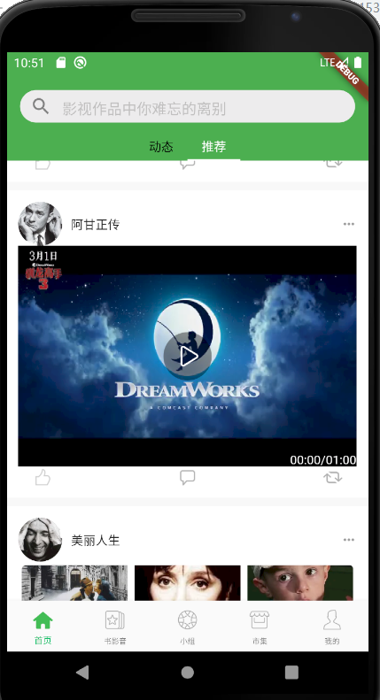

## 视频显示

安卓无法播放 http 视频， 修改  AndroidManifest.xml 文件：

```
<manifest ...>
    <uses-permission android:name="android.permission.INTERNET" />
    <application
        ...
        android:usesCleartextTraffic="true"
        ...>
        ...
    </application>
</manifest>
```

1、添加 cached_network_image 和 video_player 插件

2、修改 home_dart 文件中的 getContentVideo(int index) 函数：

```
import '../../widgets/video_widget.dart';

   getContentVideo(int index) {
      if(!mounted){
        return Container();
      }
      return VideoWidget(
        index == 1 ? Constant.URL_MP4_DEMO_0 :  Constant.URL_MP4_DEMO_1,
        showProgressBar: false,
      );
   }
```

3、 新建 lib\widgets\video_widget.dart

```
import 'package:cached_network_image/cached_network_image.dart';
import 'package:douban/constant/constant.dart';
import 'package:flutter/material.dart';
import 'package:video_player/video_player.dart';


class VideoWidget extends StatefulWidget {
  final String url;
  final String previewImgUrl; //预览图片的地址
  final bool showProgressBar; //是否显示进度条
  final bool showProgressText; //是否显示进度文本
  _VideoWidgetState state;
  VideoWidget(this.url,
      {Key key,
      this.previewImgUrl,
      this.showProgressBar = true,
      this.showProgressText = true})
      : super(key: key);

  @override
  _VideoWidgetState createState() {
    state = _VideoWidgetState();
    return state;
  }

  updateUrl(String url) {
    state.setUrl(url);
  }
}

class _VideoWidgetState extends State<VideoWidget> {
  VideoPlayerController _controller;
  VoidCallback listener;
  bool _showSeekBar = true;

  _VideoWidgetState() {
    listener = () {
      if (mounted) {
        setState(() {});
      }

    };
  }

  @override
  void initState() {
    super.initState();
    print('播放${widget.url}');
    _controller = VideoPlayerController.network(widget.url)
      ..initialize().then((_) {
        if(mounted){
          //初始化完成后，更新状态
          setState(() {});
          if (_controller.value.duration == _controller.value.position) {
            _controller.seekTo(Duration(seconds: 0));
            setState(() {});
          }
        }
      });
    _controller.addListener(listener);
  }


  @override
  void deactivate() {
    _controller.removeListener(listener);
    super.deactivate();
  }


  FadeAnimation imageFadeAnim;

  @override
  Widget build(BuildContext context) {
    final List<Widget> children = <Widget>[
      GestureDetector(
        child: VideoPlayer(_controller),
        onTap: () {
          setState(() {
            _showSeekBar = !_showSeekBar;
          });
        },
      ),
      getPlayController(),
    ];

    return AspectRatio(
      aspectRatio: _controller.value.aspectRatio,
      child: Stack(
        fit: StackFit.passthrough,
        children: children,
      ),
    );
  }

  @override
  void dispose() {
    super.dispose();
    _controller.dispose(); //释放播放器资源
  }

  Widget getPreviewImg() {
    return widget.previewImgUrl.isNotEmpty
        ? CachedNetworkImage(imageUrl: widget.previewImgUrl)
        : null;
  }

  getMinuteSeconds(var inSeconds) {
    if (inSeconds == null || inSeconds <= 0) {
      return '00:00';
    }
    var tmp = inSeconds ~/ Duration.secondsPerMinute;
    var minute;
    if (tmp < 10) {
      minute = '0$tmp';
    } else {
      minute = '$tmp';
    }

    var tmp1 = inSeconds % Duration.secondsPerMinute;
    var seconds;
    if (tmp1 < 10) {
      seconds = '0$tmp1';
    } else {
      seconds = '$tmp1';
    }
    return '$minute:$seconds';
  }

  getDurationText() {
    var txt;
    if (_controller.value.position == null ||
        _controller.value.duration == null) {
      txt = '00:00/00:00';
    } else {
      txt =
          '${getMinuteSeconds(_controller.value.position.inSeconds)}/${getMinuteSeconds(_controller.value.duration.inSeconds)}';
    }
    return Text(
      '$txt',
      style: TextStyle(color: Colors.white, fontSize: 14.0),
    );
  }

  getPlayController() {
    return Offstage(
      offstage: !_showSeekBar,
      child: Stack(
        children: <Widget>[
          Align(
            child: IconButton(
                iconSize: 55.0,
                icon: Image.asset(Constant.ASSETS_IMG +
                    (_controller.value.isPlaying
                        ? 'ic_pause.png'
                        : 'ic_playing.png')),
                onPressed: () {
                  if (_controller.value.isPlaying) {
                    _controller.pause();
                  } else {
                    _controller.play();
                  }
                }),
            alignment: Alignment.center,
          ),
          getProgressContent(),
          Align(
            alignment: Alignment.bottomCenter,
            child: Center(
                child: _controller.value.isBuffering
                    ? const CircularProgressIndicator()
                    : null),
          )
        ],
      ),
    );
  }

  ///更新播放的URL
  void setUrl(String url) {
    if(mounted){
      print('updateUrl');
      if (_controller != null) {
        _controller.removeListener(listener);
        _controller.pause();
      }
      _controller = VideoPlayerController.network(url)
        ..initialize().then((_) {
          //初始化完成后，更新状态
          setState(() {});
          if (_controller.value.duration == _controller.value.position) {
            _controller.seekTo(Duration(seconds: 0));
            setState(() {});
          }
        });
      _controller.addListener(listener);
    }
  }

  Widget getProgressContent() {
    return (widget.showProgressBar || widget.showProgressText
        ? Align(
            alignment: Alignment.bottomCenter,
            child: Row(
              children: <Widget>[
                Expanded(
                  child: Container(
                    height: 13.0,
                    margin: EdgeInsets.only(left: 10.0, right: 10.0),
                    child: Offstage(
                      offstage: !widget.showProgressBar,
                      child: VideoProgressIndicator(
                        _controller,
                        allowScrubbing: true,
                        colors: VideoProgressColors(
                            playedColor: Colors.amberAccent,
                            backgroundColor: Colors.grey),
                      ),
                    ),
                  ),
                ),
                Offstage(
                  child: getDurationText(),
                  offstage: !widget.showProgressText,
                )
              ],
            ),
          )
        : Container());
  }
}

class FadeAnimation extends StatefulWidget {
  FadeAnimation(
      {this.child, this.duration = const Duration(milliseconds: 1500)});

  final Widget child;
  final Duration duration;

  @override
  _FadeAnimationState createState() => _FadeAnimationState();
}

class _FadeAnimationState extends State<FadeAnimation>
    with SingleTickerProviderStateMixin {
  AnimationController animationController;

  @override
  void initState() {
    super.initState();
    animationController =
        AnimationController(duration: widget.duration, vsync: this);
    animationController.addListener(() {
      if (mounted) {
        setState(() {});
      }
    });
    animationController.forward(from: 0.0);
  }

  @override
  void deactivate() {
    animationController.stop();
    super.deactivate();
  }

  @override
  void didUpdateWidget(FadeAnimation oldWidget) {
    super.didUpdateWidget(oldWidget);
    if (oldWidget.child != widget.child) {
      animationController.forward(from: 0.0);
    }
  }

  @override
  void dispose() {
    animationController.dispose();
    super.dispose();
  }

  @override
  Widget build(BuildContext context) {
    return animationController.isAnimating
        ? Opacity(
            opacity: 1.0 - animationController.value,
            child: widget.child,
          )
        : Container();
  }
}

```

最终效果图：

