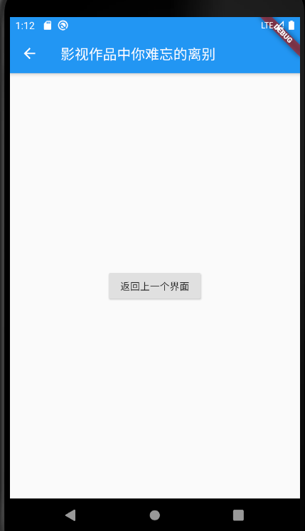

## 添加路由管理

1、删除 lib\router.dart, 添加 fluro 插件

2、新建 lib\views\search\search.dart

```
import 'package:flutter/material.dart';

class SearchPage extends StatelessWidget{
  final String searchHintContent;
  ///搜索框中的默认显示内容
  SearchPage({Key key,this.searchHintContent = '默认'})
      : super(key: key);
  @override
  Widget build(BuildContext context) {
    return Scaffold(
      appBar: AppBar(
        title: Text(searchHintContent),
      ),
      body: Center(
        child: RaisedButton(
                    onPressed: () => Navigator.pop(context, '来自第二个界面'),
                    child: Text('返回上一个界面')
                )
      ),
    );
  }
}
```

3、 新建 lib\routers\routers.dart

```
import 'package:fluro/fluro.dart';

import 'router_handler.dart';

class Routes{
  static String root = "/";
  static String home = "/home";
  static String searchPage = '/SearchPage';
  static void configureRoutes(Router router){
    router.define(home,handler: homeHandler);
    router.define(searchPage, handler: searchPageHandler);
  }
}
```

4、 新建 lib\routers\router_handler.dart

```
import '../views/search/search.dart';
import '../views/home/home_page.dart';
import 'package:fluro/fluro.dart';
import 'package:flutter/material.dart';

var homeHandler = new Handler(
  handlerFunc: (BuildContext context, Map<String, dynamic> params){
    return HomePage();
  }
);
var searchPageHandler = new Handler(
  handlerFunc: (BuildContext context, Map<String, List<String>> params) {
    String searchHintContent = params['searchHintContent']?.first;
    return SearchPage(searchHintContent: searchHintContent,);
  }
);
```

5、 新建 lib\application.dart

```

import 'package:fluro/fluro.dart';

enum ENV{
  PRODUCTION,
  DEV,
}
class Application{
  static ENV env = ENV.DEV;
  static String test = 'test';
  static Router router;
}
/// 所有获取配置的唯一入口
  Map<String, String> get config {
    if (Application.env == ENV.PRODUCTION) {
      return {};
    }
    if (Application.env == ENV.DEV) {
      return {};
    }
    return {};
  }
```

6、 修改 main.dart

```
import 'application.dart';

// 省略....

class MyApp extends StatelessWidget{

  // 省略....

  MyApp(){
    final router = new Router();
    Routes.configureRoutes(router);
    Application.router = router;
  }

  // 省略....

}
// 省略....

```
7、修改 lib\views\home\home_page.dart

```
child: SearchTextFieldWidget(
                    hintText: '影视作品中你难忘的离别',
                    margin: const EdgeInsets.only(left: 15.0, right: 15.0),
                    onTab: () {
                      var str = Uri.encodeComponent('影视作品中你难忘的离别');
                      Application.router.navigateTo(context, '${Routes.searchPage}?searchHintContent=$str');
                    },
                  ),
```


运行 flutter run 

点击搜索栏，跳转到搜索页面

