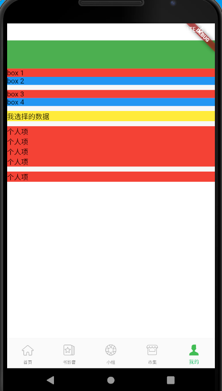
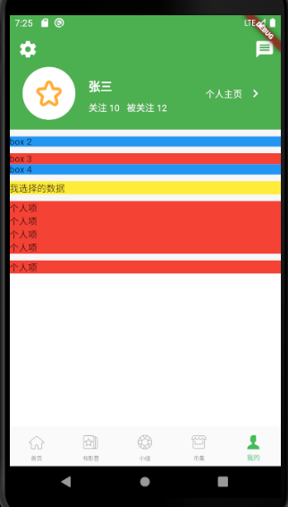
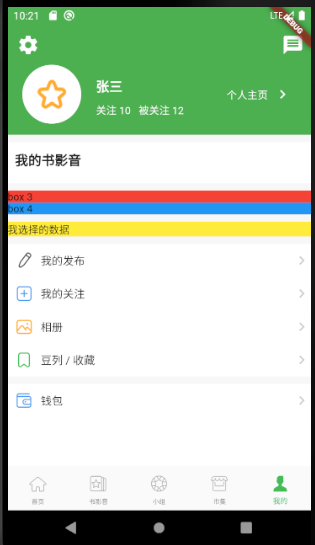
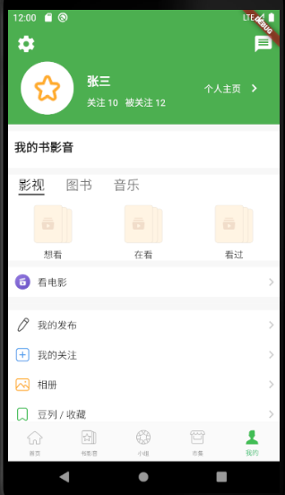
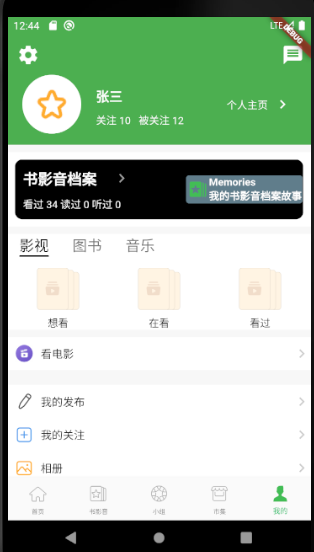

## 个人页面

### 页面布局



修改 lib\views\person\person_page.dart,用以下代码替换

```
import 'package:flutter/material.dart';

class PersonCenterPage extends StatelessWidget{
  @override
  Widget build(BuildContext context) {
    // Scaffold 实现了基本的 material 布局
    return Scaffold(
      backgroundColor: Colors.green,
      // SafeArea 解决异形屏的问题
      body: SafeArea(
           child: NestedScrollView(
             headerSliverBuilder: (BuildContext context, bool innerBoxIsScrolled){
               return <Widget>[
                  PersonSliverAppBar(),
               ];
             }, 
             body: Container(
               color: Colors.white,
               child: CustomScrollView(
                slivers: <Widget>[
                  _divider(),
                  SliverToBoxAdapter(
                    child: Container(
                      color: Colors.blue,
                      child: Text('box 2'),
                    ),
                  ),
                  _divider(),
                  SliverToBoxAdapter(
                    child: Container(
                      color: Colors.red,
                      child: Text('box 3'),
                    ),
                  ),
                  _divider(),
                  SliverToBoxAdapter(
                    child: Container(
                      color: Colors.blue,
                      child: Text('box 4'),
                    ),
                  ),
                  _divider(),
                  _dataSelect(),
                  _divider(),
                  _personItem('ic_me_journal.png', '我的发布'),
                  _personItem('ic_me_follows.png', '我的关注'),
                  _personItem('ic_me_photo_album.png', '相册'),
                  _personItem('ic_me_doulist.png', '豆列 / 收藏'),
                  _divider(),
                  _personItem('ic_me_wallet.png', '钱包'),
                 ]
               ),
             ),
          ), 
      ),
    );
  }
  // 分割线
  SliverToBoxAdapter _divider(){
    return SliverToBoxAdapter(
      child: Container(
        height:10.0,
        color: const Color.fromARGB(255, 247, 247, 247),
      ),
    );
  }
  _dataSelect(){
    return UseNetDataWidget();
  }
}
SliverToBoxAdapter _personItem(String imgAsset, String title, {VoidCallback onTab}){
  return SliverToBoxAdapter(
    child: Container(
      color: Colors.red,
      child: Text('个人项'),
    ),
  );
}
///这个用来改变书影音数据来自网络还是本地模拟
class UseNetDataWidget extends StatefulWidget{
  @override
  _UseNetDataWidgetState createState()=>_UseNetDataWidgetState();
}
class _UseNetDataWidgetState extends State<UseNetDataWidget> {
  bool mSelectNetData = false;
  @override
  Widget build(BuildContext context) {
    
    return SliverToBoxAdapter(
      child: Container(
        color: Colors.yellow,
        child: Text(
          '我选择的数据'
        ),
      )
    );
  }
}
class PersonSliverAppBar extends StatelessWidget{
  @override
  Widget build(BuildContext context) {
    return SliverAppBar(
        backgroundColor: Colors.green,
        //是否随着滑动隐藏标题
        snap: false,
        floating: false,
        // 是否固定在顶部
        pinned: true,
        expandedHeight: 150.0, 
        leading: IconButton(icon: Icon(Icons.settings), onPressed: (){
          print('设置');
        }),
        actions: <Widget>[
          IconButton(icon: Icon(Icons.message), onPressed: (){
            print('查看消息');
          })
        ],
        flexibleSpace: FlexibleSpaceBar(
          centerTitle: true,
          title: Text(
            '我的',
          ),
        ),
      );
  }
  
}
```

### AppBar



1、修改person_page, 替换 class PersonSliverAppBar

```
class PersonSliverAppBar extends StatelessWidget{
  @override
  Widget build(BuildContext context) {
    return SliverAppBar(
        backgroundColor: Colors.green,
        //是否随着滑动隐藏标题
        snap: false,
        floating: false,
        // 是否固定在顶部
        pinned: true,
        expandedHeight: 150.0, 
        leading: IconButton(iconSize: 30, icon: Icon(Icons.settings), onPressed: (){
          print('设置');
        }),
        actions: <Widget>[
          IconButton(iconSize: 30, icon: Icon(Icons.message), onPressed: (){
            print('查看消息');
          })
        ],
        flexibleSpace: FlexibleSpaceBar(
          centerTitle: true,
          background: Container(
            padding: EdgeInsets.only(top:50.0,left:20,right:10,bottom:10),
            child: PersonInfo(),
          ),
        ),
      );
  }
  
}
class PersonInfo extends StatelessWidget{
  @override
  Widget build(BuildContext context) {
    
    return Row(
      mainAxisAlignment: MainAxisAlignment.start,
      children: <Widget>[
        CircleAvatar(
          radius: 40,
          backgroundColor: Colors.white,
          child: Image.asset(Constant.ASSETS_IMG + 'ic_info_done.png'),
        ),
        Expanded(
          child: Padding(
            padding: EdgeInsets.only(left:20.0),
            child: Padding(
              padding: EdgeInsets.only(top:20),
              child: Column(
                crossAxisAlignment: CrossAxisAlignment.start,
                children: <Widget>[
                  Container(
                    padding:EdgeInsets.only(bottom:10.0),
                    child: Text(
                      '张三',
                      style: TextStyle(
                        fontWeight: FontWeight.bold,
                        fontSize: 18.0,
                        color: Colors.white
                      ),
                    ),
                  ),
                  Row(
                    children: <Widget>[
                      Container(child: Text(
                        '关注 10',
                        style: TextStyle(
                          color: Colors.white
                        ),
                      )),
                      Container(
                        margin: EdgeInsets.only(left:10),
                        child: Text(
                          '被关注 12',
                          style: TextStyle(
                            color: Colors.white
                          ),
                        )
                      )
                    ],
                  ),
                ],
              ),
            ) 
          ),
        ),
        Container(
          child: Row(
            children: <Widget>[
              Container(
                child:Text('个人主页',
                  textAlign: TextAlign.right,
                  style: TextStyle(
                    color: Colors.white
                  ),
                )
              ),
              IconButton(
                icon: Icon(
                  Icons.chevron_right,
                  color: Colors.white,
                ),
                alignment: AlignmentDirectional.centerStart,
                onPressed: (){
                  print('个人主页');
                })
            ],
          ),
        )
      ],
    );
  }
```
### 个人项



修改 person_center_page.dart,替换 _personItem 函数：


```
SliverToBoxAdapter _personItem(String imgAsset, String title, {VoidCallback onTab}){
  return SliverToBoxAdapter(
    child: GestureDetector(
      behavior: HitTestBehavior.translucent,
      onTap: onTab,
      child: Row(
        children: <Widget>[
          Padding(
            padding: EdgeInsets.all(10.0),
            child: Image.asset(
              Constant.ASSETS_IMG + imgAsset,
              width:25.0,
              height: 25.0
            ),
          ),
          Expanded(
            child: Text(
              title,
              style: TextStyle(fontSize: 15.0)
            ),
          ),
          _rightArrow()
        ],
      ),
    )
  );
}
_rightArrow() {
    return Icon(
      Icons.chevron_right,
      color: const Color.fromARGB(255, 204, 204, 204),
    );
}
```

### 书影音tab



打开 person_center_page

将以下代码
```
SliverToBoxAdapter(
                    child: Container(
                      child: Text('box 3'),
                    ),
                  ),
```

替换成

```
SliverToBoxAdapter(
                    child: Container(
                      child: VideoBookMusicBookWidget(),
                    ),
                  ),
```

同时添加

```
class VideoBookMusicBookWidget  extends StatefulWidget{
  @override
  State<StatefulWidget> createState() {
    
    return _VideoBookMusicBookWidgetState();
  }

}
TabController _tabController;
final List<String> tabTxt = ['影视', '图书', '音乐'];
class TabBarWidget extends StatefulWidget{
  @override
  State<StatefulWidget> createState() {
    return _TabBarWidgetState();
  }

}
class _TabBarWidgetState extends State<TabBarWidget>{
  Color selectColor, unselectedColor;
  TextStyle selectStyle, unselectedStyle;
  List<Widget> tabWidgets;

  @override
  void initState(){
    super.initState();
    selectColor = Colors.black;
    unselectedColor = Color.fromARGB(255, 117, 117, 117);
    selectStyle = TextStyle(fontSize: 18, color: selectColor);
    unselectedStyle = TextStyle(fontSize: 18, color: selectColor);
    tabWidgets = tabTxt.map((item) => 
      Text(
        item,
        style: TextStyle(fontSize: 20),
      )
    ).toList();
  }

  @override
  void dispose(){
    super.dispose();
    if (_tabController != null ) {
      _tabController.dispose();
    }
  }

  @override
  Widget build(BuildContext context) {
    return TabBar(
      tabs: tabWidgets,
      isScrollable: true,
      indicatorColor: selectColor,
      labelColor: selectColor,
      labelStyle: selectStyle,
      unselectedLabelColor: unselectedColor,
      unselectedLabelStyle: unselectedStyle,
      indicatorSize: TabBarIndicatorSize.label,
      controller: _tabController,
    );
  }
  
}
class _VideoBookMusicBookWidgetState extends State<VideoBookMusicBookWidget>
  with SingleTickerProviderStateMixin{
  
  @override
  void initState() {
    super.initState();
    _tabController = TabController(length: tabTxt.length, vsync: this);
  }
  @override
  Widget build(BuildContext context) {
    
    return Container(
      height: 130.0,
      child: DefaultTabController(
        length: tabTxt.length,
        child: Column(
          children: <Widget>[
            Align(
              child: TabBarWidget(),
              alignment: Alignment.centerLeft,
            ),
            _tabView()
          ]
        ),
      ),
    );
  }
  Widget _tabView(){
    return Expanded(
      child: TabBarView(
        children: [
          _tabBarItem('bg_videos_stack_default.png'),
          _tabBarItem('bg_books_stack_default.png'),
          _tabBarItem('bg_music_stack_default.png'),
        ],
        controller: _tabController,
      ),
    );
  }
  _tabBarItem(String img){
    return Row(
      mainAxisAlignment: MainAxisAlignment.spaceAround,
      children: <Widget>[
        getTabViewItem(img, '想看'),
        getTabViewItem(img, '在看'),
        getTabViewItem(img, '看过'),
      ],
    );
  }
  Widget getTabViewItem(String img, String txt){
    return Column(
      children: <Widget>[
        Expanded(
          child: Padding(
            padding: EdgeInsets.only(top: 15.0, bottom: 7.0),
            child: Image.asset(
              Constant.ASSETS_IMG + img,
              fit: BoxFit.contain,
            ),
          ),
        ),
        Text(txt),
      ],
    );
  }
```

### 书影音档案



修改 person_center_page：

将

```
SliverToBoxAdapter(
                    child: Container(
                      color: Colors.blue,
                      child: Text('box 4'),
                    ),
                  ),
```
替换成：

```
Records(),
```

添加代码：

```
class Records extends StatelessWidget{
  @override
  Widget build(BuildContext context) {
    
    return SliverToBoxAdapter(
        child: Container(
          decoration: BoxDecoration(
            //背景
            color: Colors.black,
            //设置四周圆角 角度
            borderRadius: BorderRadius.all(Radius.circular(10.0)),
            //设置四周边框
            border: Border.all(width: 1, color: Colors.black),
          ),
          margin: EdgeInsets.all(10.0),
          child: Row(
            children: <Widget>[
              Expanded(
                child: Column(
                  crossAxisAlignment: CrossAxisAlignment.start,
                  children: <Widget>[
                    Row(
                      children: <Widget>[
                        Container(
                          padding: EdgeInsets.all(10.0),
                          child:Text(
                            '书影音档案',
                            style: TextStyle(color: Colors.white,fontWeight:FontWeight.bold,fontSize: 20),
                          ),
                         ),
                         IconButton(icon: Icon(Icons.chevron_right,color: Colors.grey,), onPressed: (){
                           print('书影音档案');
                         }),
                      ],
                    ),
                    Container(
                      padding: EdgeInsets.only(left:10,right:10,bottom: 10),
                      child:Text(
                        '看过 34 读过 0 听过 0',
                        style: TextStyle(color: Colors.white,),
                      ),
                    ),
                  ],
                ),
              ),
              Container(
                child: Container(
                  decoration: BoxDecoration(
                    color: Colors.blueGrey,
                    borderRadius: BorderRadius.all(Radius.circular(4.0)),
                    border: Border.all(width: 1, color: Colors.transparent),
                  ),
                  child: Row(
                    children: <Widget>[
                      Image.asset(
                        Constant.ASSETS_IMG + 'ic_tab_subject_active.png',
                        width: 30,
                        height: 30,
                      ),
                      Column(
                        crossAxisAlignment: CrossAxisAlignment.start,
                        children: <Widget>[
                          Text(
                            'Memories',
                            style: TextStyle(color: Colors.white,fontWeight:FontWeight.bold),
                          ),
                          Text(
                            '我的书影音档案故事',
                            style: TextStyle(color: Colors.white,fontWeight:FontWeight.bold),
                          )
                        ],
                      ),
                    ],
                  ),
                ),
              ),
            ]
          ),
        ),
    );
  }
  
}
```