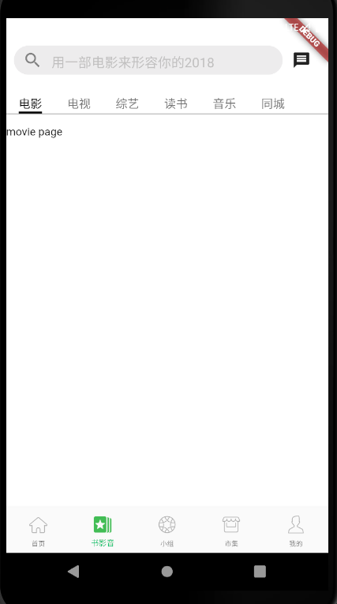

# 书影音页面

## 基本框架 



1、新建 lib\widgets\my_tab_bar_widget.dart

```
import 'package:douban/views/douya_top_250_list_widget.dart';
import 'package:douban/views/movie/movie_page.dart';
import 'package:flutter/material.dart';

class FlutterTabBarView extends StatelessWidget{
  final TabController tabController;
  FlutterTabBarView({Key key, @required this.tabController}) :super(key:key);
  @override
  Widget build(BuildContext context) {
    print('build FlutterTabBarView');
    var viewList = [
      MoviePage(key: PageStorageKey<String>('MoviePage'),),
      Page1(),
      DouBanListView(key: PageStorageKey<String>('DouBanListView'),),
      Page2(),
      Page4(),
      Page5(),
    ];
    return TabBarView(
      children: viewList,
      controller: tabController,
    );
  }
  
}

class Page1 extends StatelessWidget {
  @override
  Widget build(BuildContext context) {
    print('build Page1');

    return Center(
      child: Text('Page1'),
    );
  }
}

class Page2 extends StatelessWidget {
  @override
  Widget build(BuildContext context) {
    print('build Page2');
    return Center(
      child: Text('Page2'),
    );
  }
}

class Page3 extends StatelessWidget {
  @override
  Widget build(BuildContext context) {
    print('build Page3');
    return Center(
      child: Text('Page3'),
    );
  }
}

class Page4 extends StatelessWidget {
  @override
  Widget build(BuildContext context) {
    print('build Page4');
    return Center(
      child: Text('Page4'),
    );
  }
}

class Page5 extends StatelessWidget {
  @override
  Widget build(BuildContext context) {
    print('build Page5');
    return Center(
      child: Text('Page5'),
    );
  }
}
```

2、新建 lib\views\douya_top_250_list_widget.dart

```
import 'package:flutter/material.dart';

class DouBanListView extends StatelessWidget{
  DouBanListView({Key key}):super(key:key);
  @override
  Widget build(BuildContext context) {

    return Container(
      child: Text('douban list view'),
    );
  }
  
}
```

3、新建 lib\views\movie\movie_page.dart

```
class MoviePage extends StatelessWidget{
  MoviePage({Key key}):super(key:key);
  @override
  Widget build(BuildContext context) {
    
    return Container(
      child: Text('movie page'),
    );
  }
  
}
```

4、修改 lib\views\movie\book_audio_video_page.dart

```


import 'package:douban/application.dart';
import 'package:douban/routers/routers.dart';
import 'package:douban/widgets/my_tab_bar_widget.dart';
import 'package:douban/widgets/search_text_field_widget.dart';
import 'package:flutter/material.dart';
import 'dart:math' as math;

var titleList = ['电影', '电视', '综艺', '读书', '音乐', '同城'];

List<Widget> tabList;
TabController _tabController;
class BookAudioVideoPage extends StatefulWidget{
  @override
  State<StatefulWidget> createState() => _BookAudioVideoPageState();
}
class _BookAudioVideoPageState extends State<BookAudioVideoPage> with SingleTickerProviderStateMixin{
  var tabBar;

  @override
  void initState(){
    super.initState();
    tabBar = HomePageTabBar();
    tabList = getTabList();
    // _tabController = TabController(vsync: this, length: tabList.length);
  }
  List<Widget> getTabList(){
    return titleList.map((item)=> Text('$item',style: TextStyle(fontSize: 15),)).toList();
  }
  @override
  Widget build(BuildContext context) {
    return Container(
      color: Colors.white,
      child: SafeArea(
        child: DefaultTabController(
          length: tabList.length,
          child: _getNestedScrollView(tabBar),
        ),
      ),
    );
  }
}

Widget _getNestedScrollView(Widget tabBar){
  String hintText = '用一部电影来形容你的2018';
  return NestedScrollView(
    headerSliverBuilder: (BuildContext context, bool innerBoxIsScrolled) {
      return <Widget>[
        SliverToBoxAdapter(
          child: Container(
            color: Colors.white,
            padding: const EdgeInsets.all(10.0),
            child:Row(
              children: <Widget>[
                Expanded(
                  child: SearchTextFieldWidget(
                      hintText: hintText,
                      onTab: () {
                        Application.router.navigateTo(context, '${Routes.searchPage}?searchHintContent=${Uri.encodeComponent(hintText)}');
                      },
                  ),
                ),
                IconButton(
                  icon: Icon(Icons.message),
                  onPressed: (){
                    print('message');
                  },
                ),
              ],
            ),
          ),
        ),
        SliverPersistentHeader(
          floating: true,
          pinned: true,
          delegate: _SliverAppBarDelegate(
            maxHeight: 49.0,
            minHeight: 49.0,
            child: Container(
              color: Colors.white,
              child: tabBar,
            )
          ),
        ),
        
      ];
    },
    body: FlutterTabBarView(
      tabController: _tabController,
    ),
  );
}
class HomePageTabBar extends StatefulWidget{
  HomePageTabBar({Key key}):super(key:key);
  
  @override
  State<StatefulWidget> createState() => _HomePageTabBarState();

}
class _HomePageTabBarState extends State<HomePageTabBar>{
  Color selectColor, unselectedColor;
  TextStyle selectStyle, unselectedStyle;

  @override
  void initState() {
    super.initState();
    selectColor = Colors.black;
    unselectedColor = Color.fromARGB(255, 117, 117, 117);
    selectStyle = TextStyle(fontSize: 18, color: selectColor);
    unselectedStyle = TextStyle(fontSize: 18, color: selectColor);
  }

  @override
  void dispose() {
    _tabController.dispose();
    super.dispose();
  }
  @override
  Widget build(BuildContext context) {
    
    return Container(
      decoration: BoxDecoration(
        border: Border(bottom: BorderSide(width: 1,color: Colors.grey)),
      ),
      margin: EdgeInsets.only(top:10.0,bottom: 10.0),
      child: TabBar(
        tabs: tabList,
        isScrollable: true,
        controller: _tabController,
        indicatorColor: selectColor,
        labelColor: selectColor,
        labelStyle: selectStyle,
        unselectedLabelColor: unselectedColor,
        unselectedLabelStyle: unselectedStyle,
        indicatorSize: TabBarIndicatorSize.label,
      ),
    );
  }
}
class _SliverAppBarDelegate extends SliverPersistentHeaderDelegate{

   _SliverAppBarDelegate({
    @required this.minHeight,
    @required this.maxHeight,
    @required this.child,
  });

  final double minHeight;
  final double maxHeight;
  final Widget child;

  @override
  Widget build(BuildContext context, double shrinkOffset, bool overlapsContent) {
    return child;
  }

  @override
  double get maxExtent => math.max((minHeight ?? kToolbarHeight),minExtent);

  @override
  double get minExtent => minHeight;

  @override
  // 返回真就重新渲染SliverPersistentHeader
  bool shouldRebuild(_SliverAppBarDelegate oldDelegate) {

    return maxHeight != oldDelegate.maxHeight || minHeight != oldDelegate.minHeight || child!=oldDelegate.child;
  }
  
}
```


