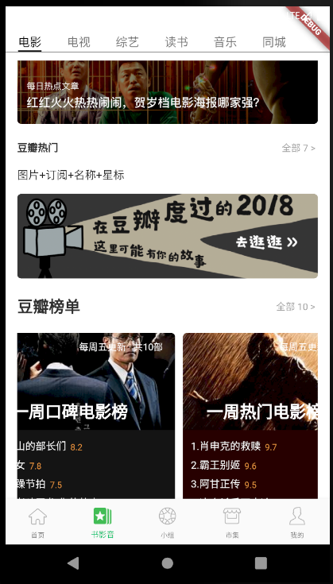

# 电影页面-6豆瓣榜单



##　ItemCountTitle

修改 lib\widgets\item_count_title.dart

```
import 'package:douban/constant/color_constant.dart';
import 'package:douban/constant/text_size_constant.dart';
import 'package:flutter/material.dart';

typedef OnClick = void Function();
///左边是豆瓣热门，右边是全部
class ItemCountTitle extends StatelessWidget{
  final count;
  final OnClick onClick;
  final String title;
  final double fontSize;

  ItemCountTitle(this.title, {Key key, this.onClick, this.count, this.fontSize})
      : super(key: key);
  @override
  Widget build(BuildContext context) {
    
    return GestureDetector(
      onTap: (){
        if (onClick != null ){
          onClick();
        }
      },
      child: Row(
        children: <Widget>[
          Expanded(
            child: Text(
              title,
              style: TextStyle(
                fontSize: fontSize == null ? TextSizeConstant.BookAudioPartTabBar:fontSize,
                fontWeight: FontWeight.bold,
                color: ColorConstant.colorDefaultTitle
              ),
            ),
          ),
          Text(
            '全部 ${count == null ? 0 : count} > ',
            style: TextStyle(
              fontSize: 12, color: Colors.grey,),
          ),
        ],
      ),
    );
  }
  
}
```

## 豆瓣榜单Item

修改 lib\views\movie\top_item_widget.dart

```
import 'package:cached_network_image/cached_network_image.dart';
import 'package:douban/constant/color_constant.dart';
import 'package:douban/model/top_item_bean.dart';
import 'package:flutter/material.dart';

class TopItemWidget extends StatelessWidget{
  final String title;
  final TopItemBean bean;
  final Color partColor;

//  var _imgSize;

  TopItemWidget({
    Key key,
    @required this.title,
    @required this.bean,
    this.partColor = Colors.brown,
  }) : super(key: key);

  @override
  Widget build(BuildContext context) {
    if (bean==null){
      return Container();
    }
    var _imgSize = MediaQuery.of(context).size.width /5*3;
    
    return Container(
      width: _imgSize,
      height: _imgSize,
      padding: EdgeInsets.only(top: 5.0, right: 10.0, bottom: 5.0),
      child: ClipRRect(
        borderRadius: BorderRadius.all(Radius.circular(5.0)),
        child: Stack(
          children: <Widget>[
            CachedNetworkImage(
              width: _imgSize,
              height: _imgSize,
              fit: BoxFit.cover,
              imageUrl: bean.imgUrl,
            ),
            Positioned(
              top: 8.0,
              right: 15.0,
              child: Text(
                bean.count,
                style: TextStyle(fontSize: 12.0, color: Colors.white),
              ),
            ),
            Positioned(
              top: _imgSize / 2 - 40.0,
              left: 30.0,
              child: Text(
                title,
                style: TextStyle(
                  fontSize: 21.0,
                  color: Colors.white,
                  fontWeight: FontWeight.bold,
                ),
              ),
            ),
            Positioned(
              top: _imgSize / 2,
              child: Container(
                height: _imgSize / 2,
                width: _imgSize,
                color: partColor,
              ),
            ),
            Positioned(
              top: _imgSize / 2,
                child: Padding(
                  padding: EdgeInsets.only(top: 10.0, left: 10.0),
                  child: Column(
                    mainAxisAlignment: MainAxisAlignment.start,
                    crossAxisAlignment: CrossAxisAlignment.start,
                    children: getChildren(bean.items),
                  ),
                )
            ),
          ],
        ),
      ),
    );
  }
  List<Widget> getChildren(List<Item> items){
    List<Widget> list = [];
    for (int i=0;i<items.length;i++){
      list.add(getItem(items[i],i+1));
    }
    return list;
  }
  Widget getItem(Item item,int i){
    return Row(
      mainAxisAlignment: MainAxisAlignment.center,
      crossAxisAlignment: CrossAxisAlignment.center,
      children: <Widget>[
        Padding(
          padding: EdgeInsets.only(right: 5.0,bottom: 5.0),
          child: Text(
            '$i.${item.title}',
            style: TextStyle(
              fontSize: 13.0,color: Colors.white
            ),
          ),
        ),
        Text(
          '${item.average}',
          style: TextStyle(fontSize: 11.0,color: ColorConstant.colorOrigin),
        ),
      ],
    );
  }
}
```

