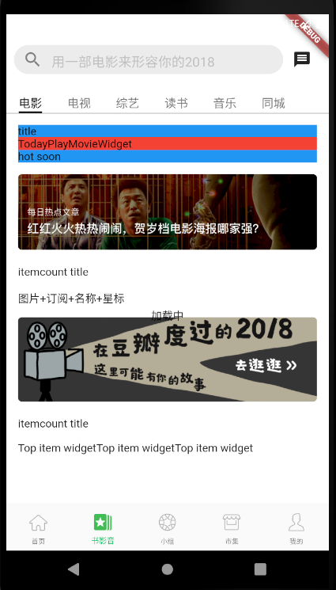

# 电影页面

## 基本布局



1、新建 lib\widgets\loading_widget.dart

```
import 'package:flutter/material.dart';

class LoadingWidget{
  static Widget getLoading({Color backgroundColor,Color loadingColr}){
    return Container(
      alignment: AlignmentDirectional.center,
      child: Text('加载中'),
    );
  }
}
```

2、新建 lib\widgets\item_count_title.dart

```
import 'package:flutter/material.dart';

typedef OnClick = void Function();
///左边是豆瓣热门，右边是全部
class ItemCountTitle extends StatelessWidget{
  final count;
  final OnClick onClick;
  final String title;
  final double fontSize;

  ItemCountTitle(this.title, {Key key, this.onClick, this.count, this.fontSize})
      : super(key: key);
  @override
  Widget build(BuildContext context) {
    
    return GestureDetector(
      child: Container(
        child: Text('itemcount title'),
      ),
    );
  }
  
}
```

3、修改 lib\model\subject.dart,添加以下代码：

```
class SubjectEntity {

//  "subject":Object{...},
//  "rank":1,
//  "delta":0

  Subject subject;
  var rank;
  var delta;

  SubjectEntity.fromMap(Map<String, dynamic> map){
    rank = map['rank'];
    delta = map['delta'];
    var subjectMap = map['subject'];
    subject = Subject.fromMap(subjectMap);
  }
}
```
4、新建 lib\views\movie\top_item_widget.dart

```
import 'package:douban/model/top_item_bean.dart';
import 'package:flutter/material.dart';

class TopItemWidget extends StatelessWidget{
  final String title;
  final TopItemBean bean;
  final Color partColor;

//  var _imgSize;

  TopItemWidget({
    Key key,
    @required this.title,
    @required this.bean,
    this.partColor = Colors.brown,
  }) : super(key: key);

  @override
  Widget build(BuildContext context) {
    
    return Container(
      child: Text('Top item widget'),
    );
  }
  
}
```

5、新建 lib\model\top_item_bean.dart

```
class TopItemBean{
  var count;//共多少部
  var imgUrl;//图片url
  List<Item> items;//多少个电影
  TopItemBean(this.count, this.imgUrl, this.items);
}
class Item {
  var title; //电影名称
  var average; //评分
  bool upOrDown; //热度上升还是下降

  Item(this.title, this.average, this.upOrDown);
}
```

6、新建 lib\widgets\image\cache_img_radius.dart

```
import 'package:cached_network_image/cached_network_image.dart';
import 'package:flutter/material.dart';

typedef OnTab = void Function();

class CacheImgRadius extends StatelessWidget {
  final String imgUrl;
  final double radius;
  final OnTab onTab;
  CacheImgRadius({Key key, @required this.imgUrl, this.radius, this.onTab})
      : super(key: key);

  @override
  Widget build(BuildContext context) {
    return GestureDetector(
      child: ClipRRect(
        borderRadius: BorderRadius.all(Radius.circular(radius)),
        child: CachedNetworkImage(imageUrl: imgUrl),
      ),
      onTap: () {
        onTab();
      },
    );
  }
}
```
2、修改 lib\views\movie\movie_page.dart,用以下代码替换：

```
import 'package:douban/constant/constant.dart';
import 'package:douban/model/subject.dart';
import 'package:douban/model/top_item_bean.dart';
import 'package:douban/views/movie/top_item_widget.dart';
import 'package:douban/widgets/image/cache_img_radius.dart';
import 'package:douban/widgets/item_count_title.dart';
import 'package:douban/widgets/loading_widget.dart';
import 'package:flutter/material.dart';
import 'dart:math' as math;

typedef OnTab = void Function();
bool loading = true;
// 电影页面
class MoviePage extends StatefulWidget{
  MoviePage({Key key}):super(key:key);
  @override
  State<StatefulWidget> createState() => _MoviePageState();
}
// 电影页面
class _MoviePageState extends State<MoviePage> with AutomaticKeepAliveClientMixin{
  Widget titleWidget, hotSoonTabBarPadding;
  List<Subject> hotShowBeans = List(); //影院热映
  List<Subject> comingSoonBeans = List(); //即将上映
  List<Subject> hotBeans = List(); //豆瓣榜单
  List<SubjectEntity> weeklyBeans = List(); //一周口碑电影榜
  List<Subject> top250Beans = List(); //Top250
  var hotChildAspectRatio;
  var comingSoonChildAspectRatio;
  int selectIndex = 0; //选中的是热映、即将上映
  var itemW;
  var imgSize;
  List<String> todayUrls = [];
  TopItemBean weeklyTopBean, weeklyHotBean, weeklyTop250Bean;
  Color weeklyTopColor, weeklyHotColor, weeklyTop250Color;
  Color todayPlayBg = Color.fromARGB(255, 47, 22, 74);
  // 页面保存在内存中不销毁
  @override
  bool get wantKeepAlive => true;

  @override
  void initState(){
    super.initState();
    print('init movie_page');
  }

  @override 
  Widget build(BuildContext context){
    print('build movie_page');
    if (itemW == null || imgSize <= 0) {
      MediaQuery.of(context);
      var w = MediaQuery.of(context).size.width;
      imgSize = w / 5 * 3;
      itemW = (w - 30.0 - 20.0) / 3;
      hotChildAspectRatio = (377.0 / 674.0);
      comingSoonChildAspectRatio = (377.0 / 742.0);
    }
    return Stack(
      children: <Widget>[
        // 主体内容
        containerBody(),
        // 正在加载页面，加载内容时会覆盖页面
        Offstage(
          child: LoadingWidget.getLoading(backgroundColor: Colors.green),
          offstage: !loading,
        ),  
      ],
    );
  }
  Widget containerBody(){
    return Padding(
      padding: EdgeInsets.only(left: 15,right:15),
      child: CustomScrollView(
        physics: BouncingScrollPhysics(),
        shrinkWrap: true,
        slivers: <Widget>[
          // title
          SliverToBoxAdapter(
            child: Container(
              color: Colors.blue,
              child: Text('title'),
            ),
          ),
          SliverToBoxAdapter(
            child: Container(
              color: Colors.red,
              child: Text('TodayPlayMovieWidget'),
            ),
          ),
          SliverToBoxAdapter(
            child: Container(
              color: Colors.blue,
              child: Text('hot soon'),
            ),
          ),
          SliverGrid(
            delegate: SliverChildBuilderDelegate(
              (BuildContext context,int index){
                var hotMovieBean;
                var comingSoonBean;
                if (hotShowBeans.length>0){
                  hotMovieBean = hotShowBeans[index];
                }
                if(comingSoonBeans.length>0){
                  comingSoonBean  = comingSoonBeans[index];
                }
                return Stack(
                  children: <Widget>[
                    Offstage(
                      child: _getComingSoonItem(comingSoonBean,itemW),
                      offstage: !(selectIndex == 1 && comingSoonBeans!=null && comingSoonBeans.length>0),
                    ),
                    Offstage(
                      child: _getHotMovieItem(hotMovieBean, itemW),
                      offstage: !(selectIndex == 0 &&
                          hotShowBeans != null &&
                          hotShowBeans.length > 0)
                    ),
                  ],
                );
              },
              childCount: math.min(_getChildCount(),6)
            ),
            gridDelegate: SliverGridDelegateWithFixedCrossAxisCount(
              crossAxisCount: 3,
              crossAxisSpacing: 10.0,
              mainAxisSpacing: 0.0,
              childAspectRatio: _getRatio()
            ),
          ),
          getCommonImg(Constant.IMG_TMP1, null),
          SliverToBoxAdapter(
            child: Padding(
              padding: EdgeInsets.only(top: 20.0, bottom: 15.0),
              child: ItemCountTitle(
                '豆瓣热门',
                fontSize: 13.0,
                count: hotBeans == null ? 0 : hotBeans.length,
              ),
            ),
          ),
          getCommonSliverGrid(hotBeans),
          getCommonImg(Constant.IMG_TMP2, null),
          SliverToBoxAdapter(
            child: Padding(
              padding: EdgeInsets.only(top: 20.0, bottom: 15.0),
              child: ItemCountTitle(
                '豆瓣榜单',
                count: weeklyBeans == null ? 0 : weeklyBeans.length,
              ),
            ),
          ),
          SliverToBoxAdapter(
            child: Container(
              height: imgSize,
              child: ListView(
                scrollDirection: Axis.horizontal,
                children: <Widget>[
                  TopItemWidget(
                    title: '一周口碑电影榜',
                    bean: weeklyTopBean,
                    partColor: weeklyTopColor,
                  ),
                  TopItemWidget(
                    title: '一周热门电影榜',
                    bean: weeklyHotBean,
                    partColor: weeklyHotColor,
                  ),
                  TopItemWidget(
                    title: '豆瓣电影 Top250',
                    bean: weeklyTop250Bean,
                    partColor: weeklyTop250Color,
                  )
                ],
              ),
            ),
          ),
        ],
      ),
    );
  }

  double _getRatio(){
    if (selectIndex == 0) {
      return hotChildAspectRatio;
    } else {
      return comingSoonChildAspectRatio;
    }
  }
  int _getChildCount() {
    if (selectIndex == 0) {
      return hotShowBeans.length;
    } else {
      return comingSoonBeans.length;
    }
  }
  getCommonImg(String url, OnTab onTab){
    return SliverToBoxAdapter(
      child: Padding(
        padding: EdgeInsets.only(top:15.0),
        child: CacheImgRadius(
          imgUrl:url,
          radius: 5.0,
          onTab: () {
            if (onTab !=null){
              onTab();
            }
          }
        ),
      ),
    );
  }

  // 即将上映item
  Widget _getComingSoonItem(Subject comingSoonBean, var itemW){
    if (comingSoonBean == null) {
      return Container();
    }
    return Container(
      child: Text('即将上映'),
    );
  }

  ///影院热映item
  Widget _getHotMovieItem(Subject hotMovieBean, var itemW) {
    if (hotMovieBean == null) {
      return Container();
    }
    return Container(
      child: Text('影院热映'),
    );
  }

  ///图片+订阅+名称+星标
  Widget getCommonSliverGrid(List<Subject> hotBeans) {
    return SliverToBoxAdapter(
      child: Container(
        child: Text('图片+订阅+名称+星标'),
      ),
    );
  }
}

```